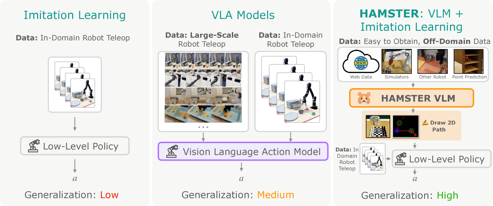
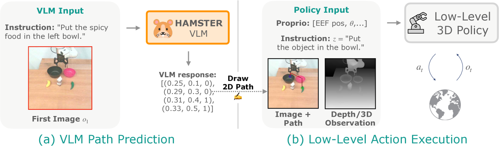
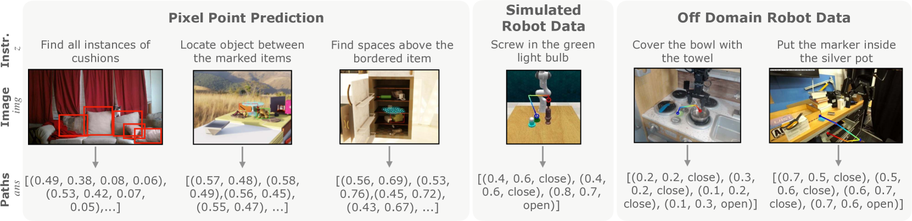
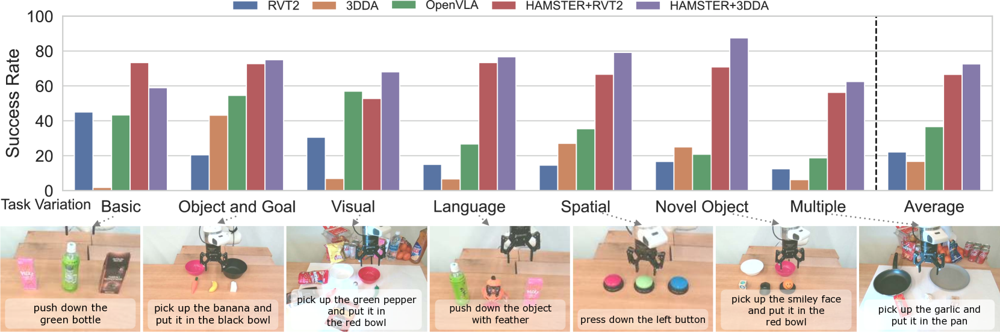
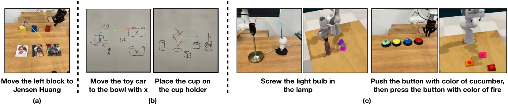

## Summary

> [!summary] HAMSTER: Hierarchical Action Models For Open-World Robot Manipulation
> - **核心**: 把 VLA 拆成两层——高层 VLM 预测端执行器在图像平面的 2D 路径，低层 3D policy 以该路径为条件执行精细动作；关键收益是高层可以用 action-free 的 off-domain 数据（sim / 异构机器人 / 视频）训练。
> - **方法**: 微调 VILA-1.5-13B 在 RoboPoint (770k) + RLBench sim (320k) + Bridge/DROID (110k) 上预测 `[(x_t, y_t, gripper_open_t)]` 路径（RDP 简化）；低层 RVT-2 / 3D Diffuser Actor 通过把路径叠画到 RGB 或拼接通道消费该路径；高层只在 episode 开头推理一次。
> - **结果**: 真机 74 任务 222 次评估，HAMSTER 平均比 OpenVLA 高 20 pp 成功率（~50% 相对提升），比 3D policy baseline 高 ~3x；Colosseum 上用 50% 数据达到 2x 3D-DA 的成绩；VQA benchmark 基本保持 VILA-1.5-13B 水平没被 catastrophic forgetting。
> - **Sources**: [paper](https://arxiv.org/abs/2502.05485) | [website](https://hamster-robot.github.io/) | [github](https://github.com/liyi14/HAMSTER_beta)
> - **Rating**: 2 - Frontier（把"2D 轨迹作 VLM/policy 接口"这条路线做成完整的 off-domain pretrain 配方，引用 96、influential 3、方向代表作，但 repo 标 "beta" 且 1 年无更新，未成标准 checkpoint）

**Key Takeaways:**
1. **2D path 是高带宽但 embodiment-agnostic 的接口**: 比 keypoint affordance（MOKA、RoboPoint）信息更丰富，比直接 action token（OpenVLA、RT-2）更好从 off-domain 数据学习；能同时用前向运动学 / 点追踪 / 人手视频生成监督。
2. **Hierarchy 的真正价值是数据来源解耦，不是分工**: RT-Trajectory、MOKA 已证明轨迹条件化有用；HAMSTER 新增 claim 是 *fine-tune* VLM 生成轨迹（而不是 prompt 通用 VLM）能显著提升准确度，关键前提是轨迹监督能从便宜数据得到。
3. **Path-conditioning 实现细节不 trivial**: 把路径叠在 RGB 上会被 RVT-2 的 virtual reprojection 碎片化；改成 6-channel 拼接（RGB + path-only RGB）success 从 0.83 升到 1.00，novel camera 从 0.73 升到 0.98——说明"如何注入路径"的设计空间未被充分探索。
4. **共训练 VQA 保住了通用能力**: 加入 660k LLaVA VQA 数据后，14 个 VQA benchmark 上 HAMSTER 与 VILA-1.5-13B 打平，证明 co-training 能缓解 robot-specific fine-tuning 的灾难遗忘。
5. **Asynchronous 推理是 underappreciated 的工程红利**: 高层 VLM 每 episode 只跑 1 次，低层 policy 高频运行；OpenVLA 13B 端到端在 4090 只有 6Hz，HAMSTER 的 VLM 规模不再受频率约束。

**Teaser. Hierarchical VLA 概览——VLM 输出 2D 轨迹，3D policy 按轨迹执行。**

---

## Body

### 1. Motivation: Monolithic VLA 的数据瓶颈

核心问题：[[2406-OpenVLA|OpenVLA]]、[[2307-RT2|RT-2]]、[[2410-Pi0|π0]] 这类 monolithic VLA 把 VLM 直接微调成 action 预测器，必须吃 on-robot（image, proprio, action）三元组。这种数据只能靠遥操采，即便有 [[2307-RT2|Open-X]]、DROID 这种社区协同努力，规模仍远低于 web-scale 语言/视觉数据。

另一头，小的 3D policy（RVT-2、3D Diffuser Actor、[[2303-DiffusionPolicy|Diffusion Policy]]）精度高、局部鲁棒，但对 distractor、光照、新语义极脆弱。

作者提出：**把 VLM 和 policy 用一个"便宜监督能得到的"中间表征连起来**，让高层生成语义层的 guidance，低层专注几何执行。候选表征要满足：
1. 从图像序列易提取（点追踪 / 前向运动学即可）；
2. 跨 embodiment（人手、不同机械臂都能产出）；
3. 对 dynamics 细节鲁棒。

选定：**end-effector 在图像平面的 2D 轨迹 `p = [(x_t, y_t, gripper_open_t)]`，归一化像素坐标 + gripper 开关状态**。

### 2. Method

**Figure 2. HAMSTER 执行流程：VLM 单次推理生成 2D 路径，低层 policy 按路径与环境交互。**

#### 2.1 高层：VLM 路径生成

**Base model**: VILA-1.5-13B（interleaved image-text + video caption 预训练）。

**Prompt 形式**（取自 website source）：
> In the image, please execute the command described in `<quest>...</quest>`. Provide a sequence of points denoting the trajectory of a robot gripper... `<ans>[(0.25, 0.32), ..., <action>Open Gripper</action>, ...]</ans>`

**Off-domain 训练数据 $\mathcal{D}_{\text{off}}$**（三类混合 + VQA 共训练）：

| 数据源 | 规模 | 作用 |
|---|---|---|
| RoboPoint（点预测 VQA） | 770k | 教 VLM "what"：像素空间物体/空区定位 |
| RLBench sim（Franka, 81 tasks × ~1000 ep × ~4 语言） | ~320k | 教 VLM "what & how"，sim 数据 |
| Bridge (WidowX) + DROID | ~10k + ~45k → ~110k 2D paths | 教 VLM 在真实机器人场景下推理 |
| LLaVA-style VQA co-train | 660k | 保留 world knowledge |

**关键点**：
- 2D 路径从 proprio + camera intrinsics 前向投影得到——*本质上把 robot 数据当成视频数据使用*，不需要 action label（人手视频同理）。
- 用 **Ramer-Douglas-Peucker** 算法把上百点的原始轨迹稀疏化成几个关键点，让 VLM 在"高层"粒度推理。
- 所有数据统一为 VQA 格式，联合均匀采样微调；监督为标准 next-token 负对数似然。

**Figure 3. 三类 off-domain 数据的输入/输出示例。**

#### 2.2 低层：Path-conditioned 3D Policy

策略形式 $\pi_\theta(a \mid s, o, z, p)$，其中 $s$ 是 proprio，$o = (\text{img}, \text{pointcloud})$，$z$ 语言指令，$p$ 是高层给出的 2D 路径。

架构候选：
- **RVT-2**（[Goyal+ 2024]）：Robot View Transformer，多视角虚拟相机。
- **3D Diffuser Actor (3D-DA)**（[Ke+ 2024]）：diffusion 策略，输入 3D scene representation。

**路径注入方式**（两种）：
1. **Overlay**：把 `(x_t, y_t)` 画成颜色渐变的折线直接叠在 RGB 图像上，gripper 变化用不同颜色圆圈标记。通用——任何 policy 架构都能吃。
2. **Concat**：把 path 单独渲染一张 RGB 图，与原图拼成 6-channel。需要 policy 接受多通道，但性能更好（见 §3）。

**训练**：收集 ~320 条真机遥操 episode 作为 $\mathcal{D}$；训练时用 *oracle* 2D 路径（proprio 投影）作为 ground truth path；推理时用 VLM 预测的路径。

**推理频率**：VLM 每 episode 只调 1-few 次；低层策略高频运行。对比 OpenVLA 7B 在 RTX 4090 上端到端 6Hz，这一设计让 VLM backbone 可以任意放大。

> ❓ "episode 开头单次推理" 对真正长程/动态场景显然不够——文中说 "one or few times"，具体重新触发 VLM 的条件没给定义。这应是 open problem。

### 3. Experiments

#### 3.1 真机 Tabletop Manipulation（74 tasks, 222 evals）

**Figure 4. 跨 7 条泛化轴的 success score（对比 OpenVLA / RVT-2 / 3D-DA）。**

泛化轴：object/goal 组合、visual（纹理、灯光、distractor）、language（candy→sweet object）、spatial（位置关系）、novel object、multiple（组合）。

**结论**：
- HAMSTER 平均比 OpenVLA 高 ~2x，比非 VLM 的 3D policy baseline 高 ~3x。
- 跨 prehensile + non-prehensile（press button, knock down）都成立。
- 为公平起见，OpenVLA 也用 RLBench 做额外微调——几乎无提升（0.54 vs 0.58），说明 monolithic 架构难以从 sim 数据受益，而 HAMSTER 的 hierarchy 能。

**Camera view invariance**（Table 2）：

| Method | Original Success / Complete | Novel Camera Success / Complete |
|---|---|---|
| OpenVLA | 0.60 / 0.30 | 0.23 / 0.00 |
| HAMSTER+RVT-2 (overlay) | 0.83 / 0.70 | 0.73 / 0.40 |
| HAMSTER+RVT-2 (concat) | **1.00 / 1.00** | **0.98 / 0.90** |

Concat 显著优于 overlay——文中归因：RVT-2 的虚拟视角投影会把叠加在 RGB 上的路径几何撕碎，独立通道保留完整路径信号。

#### 3.2 Colosseum Simulation

Table 1: 在 5 tasks Colosseum 子集上，+3D-DA 用 **50% 数据** 就达到 vanilla 3D-DA 100% 数据 2x 的成功率，**100% 数据** 达到 2.4x——**demonstration efficiency** 由 path conditioning 带来。

Table 3（跨 15 种视觉变化轴 full Colosseum）：
- 3D-DA 平均 0.35 ± 0.04
- HAMSTER+3D-DA 平均 **0.46 ± 0.04**（+31%）
在 background texture、manipulation object texture、table texture 等 visual-heavy 轴上提升最大；在 camera pos / manipulation obj size 这类几何轴提升有限——符合直觉：path 提供的主要是语义/视觉对齐信息。

#### 3.3 VLM 本身的泛化

**Figure 7. VLM 在未见场景下的 path 生成：world-knowledge 任务、手绘 sketch 输入、sim → real 迁移。**

Appendix D.1 ablation（未嵌图）：
- HAMSTER VLM 在 path 任务上显著优于 zero-shot prompting 闭源 VLM（对应 RT-Trajectory、Code-as-Policies 的设定）。
- 去掉 RLBench sim 数据 → 真机性能降，说明 sim 数据确实在 cross-domain transfer。

**Table 4（VQA benchmark 保持）**：

| Method | VQA-v2 | GQA | VizWiz | POPE | MME | MMB | SEED | LLaVA-W | MM-Vet | MMMU |
|---|---|---|---|---|---|---|---|---|---|---|
| VILA-1.5-13B | 82.8 | 64.3 | 62.6 | 86.3 | 1569.6 | 74.9 | 65.1 | 80.8 | 44.3 | 37.9 |
| HAMSTER | 82.9 | 64.9 | 63.4 | 85.8 | **1588.4** | **75.3** | 64.2 | **81.2** | **44.4** | 37.8 |

结论：co-training 防住了 catastrophic forgetting，VLM 没退化成 narrow path-predictor。

### 4. Limitations（作者自述 + 我的观察）

作者：
1. 只预测 2D 点，没有真实 3D 空间理解——VLM 不知道深度。
2. 2D path 是窄带宽接口，无法传达力 / 旋转 / 接触模式。

我补充：
- 真机 training set 只有 320 条，所有"泛化"evals 实际上测的是同一个物理平台下的 visual/language 变化；跨 embodiment 泛化只在 VLM 那层被证明，低层 policy 仍然是 task-specific。
- "Episode 开头单次 VLM 推理"模型天然不适合动态/contact-rich 任务；论文没有 recovery 机制。
- Concat > overlay 的差距大（0.83 → 1.00）提示 overlay 这个"通用"接口其实是 HAMSTER 主推方式的次优实现；但 concat 不兼容 pretrained image encoder 的 3 通道输入，这是个真实的工程 trade-off。

---

## 关联工作

### 基于
- **VILA-1.5-13B**（[Lin+ 2024]）: 提供 interleaved image-text + video 预训练基座。
- **RoboPoint**（[Yuan+ 2024b]）: 770k 像素点预测 VQA 数据的直接来源；HAMSTER 显式感谢 Wentao Yuan 提供。
- **RLBench**（[James+ 2020]）: 81 任务模拟数据来源；用内置 planner 自动合成 320k 轨迹。
- **Bridge + DROID**: 真实机器人 off-domain 视频源。
- **RVT-2** / **3D Diffuser Actor**: 低层 3D policy 骨架。
- **Ramer-Douglas-Peucker**: 路径稀疏化算法。

### 对比
- [[2406-OpenVLA|OpenVLA]]: 核心 monolithic VLA baseline；HAMSTER 相对其提升 ~50%（7 轴平均 20pp）。
- **RT-Trajectory**（Gu+ 2023）: 最直接的 prior——也用轨迹 sketch 条件化。HAMSTER 的 delta 是：(1) *fine-tune* VLM 生成轨迹而非 prompt；(2) 低层 policy 接受 3D 输入；(3) 论证 off-domain 数据能驱动 VLM 微调。
- [[2307-RT2|RT-2]] / [[2410-Pi0|π0]]: monolithic VLA 范式，共同竞争者。
- **LLARVA**: 也预测 end-effector trajectory，但只作 auxiliary task 给 monolithic 模型。

### 方法相关
- **MOKA**（Liu+ 2024b）: mark-based visual prompting + 固定数量 waypoint 预测——关键点而非完整路径。
- **RoboPoint / PIVOT / VoxPoser**: 用 VLM 预测 keypoint affordance 或 value map 作为 policy 接口。HAMSTER 的论点：轨迹比点集表达能力更强。
- **Track-any-point policies**（Track2Act、ATM、Gen2Act）: 基于 object trajectory 条件化，与 HAMSTER 的 end-effector trajectory 是对偶选择；文中提到该框架可自然扩展到 object trajectory。
- **[[2502-HiRobot|Hi Robot]] / [[2503-MoManipVLA|MoManipVLA]]**: 其他 hierarchical VLA 工作；HAMSTER 的独特切分是"2D path 作为语言之外的显式几何接口"。
- [[2407-ECoT|ECoT]]: 也在 VLA 里插入中间表示（CoT + bounding box + gripper pos），但用于监督 action prediction 而非作为 policy 输入。

---

## 论文点评

### Strengths

1. **问题选得漂亮**: "monolithic VLA 被 on-robot 数据量卡死"是真痛点；"找一个便宜可得、embodiment-agnostic 的中间表征" 是 first-principles 的问题重构。
2. **Off-domain 数据配方具体可复制**: RoboPoint + RLBench + Bridge/DROID + VQA co-train 的比例给得明确；选择 VILA-1.5-13B 也有理由（interleaved + video caption 预训练让它对 path-in-image 任务有 inductive bias）。
3. **关键 ablation 都做了**: RLBench vs no-RLBench、overlay vs concat、50% data、camera view 变化、VQA 保持，分别对应 off-domain 有用性 / 路径注入方式 / 数据效率 / 几何泛化 / catastrophic forgetting。
4. **生成数据的自动化**: 2D path 监督从 proprio 投影得到，不需要额外人标；这是方法能 scale 的前提。
5. **跨非抓取任务的可迁移性**: press button / knock down / unfold towel / open drawer 都验证了，不是 pick-place only。

### Weaknesses

1. **"Once per episode" 推理假设被低调处理**: long-horizon 多子任务场景下 VLM 显然要多次调用，但触发机制、error recovery、replanning 都没讨论。Figure 8 的 long-horizon rollout 更像是人工拼接。
2. **2D path 的信息瓶颈已在 Colosseum 的几何轴上显形**: camera pos / manip obj size 轴提升有限，作者没诚实讨论这是"因为 2D 表征天然不编码深度"的结构问题。
3. **低层仍需 task-specific demo**: 320 条真机 data，新任务仍然要重新收。文中 framing 让人误以为 off-domain data 解决了所有问题，但其实只解决了 VLM 那层；"data efficiency" 是相对 3D-DA 的 2x，不是绝对意义上的 zero-shot。
4. **Cross-embodiment 的 claim 被夸大**: VLM 层见过 WidowX（Bridge）数据，但下游 policy 仍然 specific to测试机器人（Franka？未明确）。所谓"embodiment-agnostic 的 2D path"主要是从 pretraining 角度。
5. **Repo 状态 beta 且停滞**: `liyi14/HAMSTER_beta`，pushed 369 天前，90 天 0 commits，issues 未关——这对一篇 ICLR 被接收的工作不太合适，复现成本高。作者 claim "fully open-sourced enabler"与 repo 现状有落差。
6. **Baseline 公平性存疑**: OpenVLA 用的是原版 7B，HAMSTER 用 13B VILA；对比的 FLOPs / 参数量没 align。

### 可信评估

#### Artifact 可获取性
- **代码**: inference + training（Gradio demo server + training scripts based on VILA 仓库），但 repo 标 beta 且长期未更新。
- **模型权重**: HuggingFace 上有 VLM checkpoint（README 提到），具体名称未列出。
- **训练细节**: 仅高层描述——数据规模、VLM base model、共训练比例给了；具体超参、学习率、训练步数、compute 在 Appendix B（未完全阅读）。
- **数据集**: RoboPoint / RLBench / Bridge / DROID 均公开，320 条真机 demo 未公开。

#### Claim 可验证性
- ✅ "20% avg improvement over OpenVLA across 7 axes"：74 tasks × 3 trials ×多 baseline 的实验规模明确，Table 5 (appendix) 给了 per-task 分数，可核验。
- ✅ "hierarchical VLM benefits from off-domain data"：RLBench ablation（加 vs 不加）给了真机对比数据，OpenVLA 同 RLBench 微调对照也控制住了。
- ⚠️ "demonstration efficient (2x with 50% data)"：只在 Colosseum 5 任务子集上验证；5 任务 + 5 seeds 统计力有限，置信区间给出但未报告 p-value。
- ⚠️ "strong cross-embodiment generalization"：VLM 训练数据包含异构机器人视频，但 eval 仍然 Franka；claim 的是 VLM 可以跨，不是完整系统跨。
- ⚠️ "can scale VLM to any size due to async inference"：每 episode 单次推理的假设未充分验证在 dynamic 任务上是否成立。
- ❌ 无明显 marketing 话术。

### Notes

- **与 [[2503-MoManipVLA]]、[[2502-HiRobot]] 的关系值得展开**: 三者都是 hierarchical VLA 的当下范式；HAMSTER 选 2D path，MoManipVLA 选 waypoint + base trajectory，HiRobot 选 language subgoal。信息带宽、可监督性、robustness 三个维度各有优劣。
- **2D path vs object-centric flow**: Gen2Act、Track2Act 用 object trajectory；这对 articulated / deformable 场景可能更鲁棒。值得对比：end-effector 轨迹 vs object 轨迹 vs 二者都要，哪个是更 general 的接口？
- **Concat > overlay 的 finding 是 methodologically 有趣的小发现**: 它暗示当前的 path-conditioning 可能都被 overlay 的碎片化损伤；未来做 VLA benchmark 评估 path-based 方法时应控制这一变量。
- **为什么选 2D 而不是深度图/3D 路径？**: 作者没正面回答。推测是"2D 能从 monocular 视频/sim 无缝提取、3D 会把 off-domain 数据池缩小"——这是 accept bandwidth loss 换 data coverage 的理性选择。

### Rating

**Metrics** (as of 2026-04-22): citation=96, influential=3 (3.1%), velocity=6.67/mo; HF upvotes=0; github 59⭐ / forks=7 / 90d commits=0 / pushed 369d ago · **stale**

**分数**: 2 - Frontier

**理由**: citation 96 + velocity 6.67/mo（14 个月）表明该工作在 hierarchical VLA / path-conditioned policy 这条线上被广泛引用和讨论，是当前 frontier 的代表之一；但 influential/total 仅 3.1%（远低于典型 10%）说明它更多被当作 *landmark reference* 而非技术被实质继承——这与 2D path 接口偏窄、下游需要 task-specific demo 的局限相吻合。Repo is_stale、HF upvotes=0 也说明社区未把它作为可直接用的开源基座。综上不达 Foundation 档（对比 [[2406-OpenVLA|OpenVLA]]、[[2410-Pi0|π0]] 这类真正定义范式的工作），但明显高于 Archived 档——后续研究 hierarchical VLA 或 2D path conditioning 时必须引用与对比。
