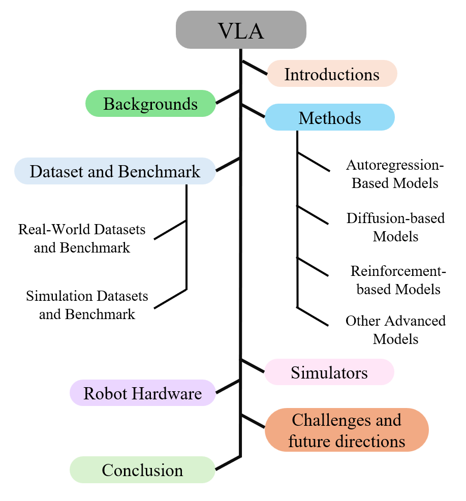
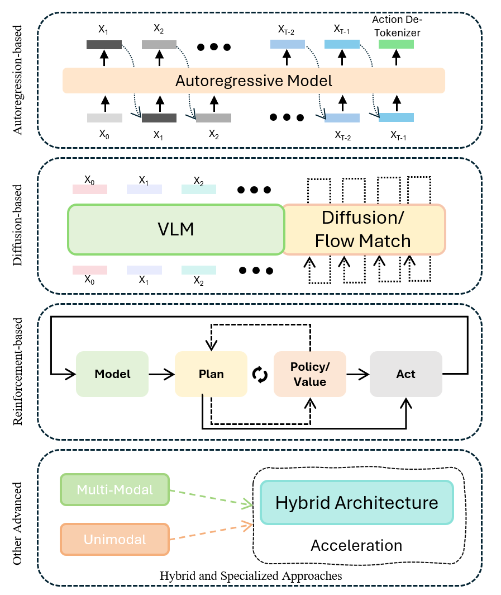
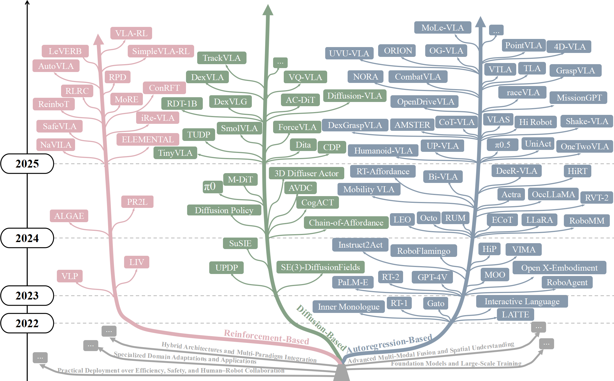

## Summary

> [!summary] Pure Vision-Language-Action (VLA) Models: A Comprehensive Survey
> - **核心**: 一篇整理了 300+ 篇 VLA 工作的综述，把 VLA 方法按**策略生成范式**划分为四大类——autoregression-based、diffusion-based、reinforcement-based、hybrid/specialized——并补充 dataset、simulator、hardware、challenges 四个附录式章节。
> - **方法**: 沿时间轴做 bucket sort，每个 bucket 再细分子类（如 autoregression 下分 generalist / reasoning+planning / trajectory generation / structural optimization）；每类附一张时间顺序的表格列代表工作的 year + 一句话创新。
> - **结果**: 无实验，无 benchmark 再跑；定性总结每个 bucket 的 "Innovations / Limitations"，结尾列出 5 个 challenges（data scarcity / arch heterogeneity / inference cost / pseudo-interaction / eval limitations）和 4 个 opportunities（world modeling / causal reasoning / sim-real integration / societal embedding）。
> - **Sources**: [paper](https://arxiv.org/abs/2509.19012)
> - **Rating**: 1 - Archived。组织清晰但 taxonomy 按 "生成器类型" 切，信息密度不及同期 Action-Tokenization 视角的 VLA 综述；citation=29、influential=1、无 github，对研究议程无 load-bearing 作用。

**Key Takeaways:** 
1. **四分法 taxonomy**：autoregression / diffusion / RL-finetune / hybrid+specialized。这不是一个严格正交的轴——很多现代 VLA（如 π0、HybridVLA）本身就跨桶，作者把它们塞进 "hybrid" 而非正面承认 taxonomy 的崩坏。
2. **"Pure VLA" 的定义模糊**：标题强调 "Pure" 但正文从未明确定义什么叫 pure、与什么对立（大约是与 hierarchical / code-generation / LLM-planner-only 对立）。这是 positioning 问题，不是 technical 问题。
3. **每个 bucket 的 Discussion 段都是模板化的 "Innovations / Limitations"**——Innovations 罗列方法名，Limitations 几乎套用同一套话术（算力贵、数据缺、泛化差、安全难），缺乏真正的 cross-cutting insight。
4. **Dataset/Simulator 章节 表格价值**：Table V 汇总了 MIME→OXE 的 15 个真实+10 个仿真数据集，带 episode/task 数，可作为挑 dataset 时的 quick lookup。
5. **Challenges 段** 提出的 "understanding the instruction but failing to execute"（语义懂但身体不会）是全文唯一一句有张力的 framing，但随后没有展开成具体的技术路线判断。

**Teaser. Survey 的整体组织与章节关系图（Figure 1）。** 

---

### Taxonomy 骨架

**Figure 1. 调研按方法论分类 + 资源 (dataset / simulator / hardware) + challenges & opportunities 两大块组织。**  
结构上：Background → 4 类方法 → Data/Simulator/Hardware → Challenges & Future，是教科书式的 survey 写法，没有跨章节的 unifying thread。

**Figure 2. VLA skeleton 示意图——抽象出 VLM backbone → action head 的通用管线。**

**Figure 3. Taxonomy tree：沿时间轴给每个 paradigm 标代表作。**

> ❓ 这种 "时间轴 + paradigm 分桶" 的可视化在 survey 里很常见，但它隐含了一个未被论证的假设：paradigm 之间是 parallel 发展的独立 branch。实际上 autoregression 和 diffusion 在 action head 选择上是**替代关系**而非 parallel branch，而 RL fine-tune 是**正交**的训练手段（可以叠在任何 action head 上）。这套 taxonomy 混了 architectural choice 和 training recipe 两个正交维度。

---

## 3 四大 Paradigm 详解

### 3.1 Autoregression-based

作者把这一桶再切成 4 小类：

1. **Autoregressive Generalist VLA**：RT-2、OpenVLA 一脉——把 action 离散化成 token，接在 LLM 语言 token 之后 next-token-predict。
2. **Reasoning + Semantic Planning with LLMs**：LLM 负责 high-level 任务分解 / plan，再下发给低层 policy。与 "pure VLA" 的 positioning 其实矛盾——作者没解释为什么这种 hierarchical 方案还算 "pure"。
3. **Trajectory Generation + Visual Alignment**：把 autoregressive head 的输出改造成 trajectory 或 waypoint，而非 raw joint action。
4. **Structural Optimization & Efficient Inference**：FAST tokenizer、action chunking、并行解码等加速手段。RT-2 的 8Hz 推理瓶颈催生出来的这一子类其实是全章最有 cross-cutting 意义的部分，但被压成最后一个小节。

**讨论段的立场**：作者承认 autoregressive 路线在 "high-frequency control" 上仍有延迟瓶颈，但对 "continuous vs discrete action" 的根本权衡没有给出明确判断——这正是后来 diffusion head 崛起的驱动力。

### 3.2 Diffusion-based

进一步分成 3 个子类：

1. **Diffusion Generalist**：SE(3)-DiffusionFields、Diffusion Policy、以及一众把 denoising 直接套到 action space 上的工作。
2. **Multimodal Architectural Fusion**：如何把 vision/language condition 喂进去——cross-attention、classifier-free guidance、ControlNet 式的 adapter。
3. **Application Optimization & Deployment**：蒸馏、一步/少步采样、flow matching 取代 DDPM 等工程优化。

**隐含的 claim**（作者没挑明但字里行间传达）：diffusion head 的动机是**连续动作分布的 multimodality**——相比 autoregressive 的离散 token，diffusion 更自然地建模多峰动作分布。这确实是 Diffusion Policy 原论文的核心 insight，但本综述没把这个 first-principle 论证拉到 paradigm 层面。

### 3.3 Reinforcement-based Fine-Tune

**Table III**（节选——共 22 条）给出 RL-VLA 时间线，列出每个工作的核心 RL 创新：

| Method | Year | Innovation |
| ---- | ---- | ---- |
| VIP / LIV | 2023 | visual-language reward 预训练，frozen VLM 也能做 reward proxy |
| GRAPE | 2024 | trajectory-level preference alignment |
| SafeVLA | 2025 | constrained policy optimization + safety critic |
| SimpleVLA-RL | 2025 | 单轨迹 + binary reward 在线 RL |
| ConRFT | 2025 | offline BC + Q-learning + online consistency 的 hybrid |
| VLA-RL | 2025 | online RL + VLM-as-reward-model |
| LeVERB / NaVILA | 2025 | RL 驱动 humanoid/quadruped whole-body control |

**作者的立场**：RL fine-tune 能补 SFT 的 distribution shift 和 sparse-reward 问题，但 reward engineering 仍 "indirect or noisy"，training stability 受 SFT-RL 博弈影响。

> ❓ 这章和 [[2411-RewardHacking|Reward Hacking]]、Agentic RL 领域的共性讨论几乎没交集——作者把 RL-VLA 当成 VLA 的 sub-branch 来讲，错过了一个有价值的 framing：**RL fine-tune 是 training recipe**，应该跨 autoregression/diffusion paradigm 正交讨论，而不是作为第三类并列 paradigm。这是前面提到的 taxonomy 维度混淆的典型表现。

### 3.4 Hybrid / Specialized

一个 catch-all 桶，再切 6 小类：hybrid arch、多模态融合 + 空间理解、domain adaptation（driving / humanoid / GUI）、foundation-scale 模型、deployment（效率/安全/HRI）、discussion。 把 π0.5、HybridVLA、GR00T 这类跨范式或大模型都塞进来。这一节最能暴露 taxonomy 的 leaky abstraction——真正的前沿工作往往不属于前 3 桶里的任何一个。

---

## 4 Datasets & Benchmarks

**Table V 精选**（完整表约 25 行）：

| Dataset | Year | Sensors | Episodes | Tasks |
| ---- | ---- | ---- | ---- | ---- |
| MIME | 2018 | RGBD | 8.3K | 20 |
| BridgeData | 2021 | RGBD | 60.1K | 24 |
| RT-1 | 2022 | RGB | 13K | 700 |
| RH20T | 2024 | RGBD | 110K | 147 |
| DROID | 2024 | RGBD | 76K | – |
| OXE | 2025 | RGBD | >1M | 160,266 |
| LIBERO (sim) | 2023 | RGB | 5K | 100 |
| RoboCasa (sim) | 2024 | RGBD | >100K | 100 |

**真实数据集**：从早期 MIME / BridgeData 的 10K 量级，到 2024-2025 的 RH20T / OXE 的 100K→1M 量级；OXE 作为 22 个数据集的 consolidator 现已成为事实标准。  
**仿真数据集**：LIBERO、RoboCasa、Meta-World、RLBench、VIMA、CALVIN 是 VLA 论文 benchmark 的主流选择。

**4.3 Discussion**：作者承认"real 贵、sim 不真"是老命题，承认当前 benchmark 的 success rate / trajectory L2 不足以覆盖 language grounding、long-horizon reasoning、safety，但没有提出具体的新评测协议建议。

---

## 5-6 Simulators + Hardware

**Simulators**：THOR、Habitat 1/2、iGibson 1/2、MuJoCo、Isaac Gym、CARLA、LGSVL 等——这部分是 embodied AI 的标配资源清单，本综述没有新增信息。

**Hardware**（§6 短短一页）：泛泛提到 sensors / actuators / control / power 四件套，没有具体分析 manipulator vs quadruped vs humanoid 的硬件差异对 VLA 设计的约束。这一章基本是**凑篇幅性质**。

---

## 7 Challenges & Opportunities

### Challenges（5 条）

1. **Scarcity of Robotic Data**：OXE 主要覆盖 tabletop，sim-real gap 未解。
2. **Architectural Heterogeneity**：vision backbone (ViT / DINOv2 / SigLIP)、LLM (PaLM / LLaMA / Qwen)、action head (discrete token / continuous / diffusion) 的 cross product 导致难以横向对比。
3. **Real-Time Inference**：autoregressive decode 的 token-by-token 延迟 + 大模型内存占用让 VLA 在 embedded 平台上 "太慢或太贵"。
4. **Pseudo-Interaction**：模型依赖 statistical co-occurrence 而非真正的 causal probing。这是全文唯一一句有力 framing："**understanding the instruction but failing to execute**"。
5. **Evaluation Limitations**：benchmark 局限于 lab setting + tabletop manipulation，outdoor / industrial / home 场景覆盖率低。

### Opportunities（4 条）

1. **World Modeling + Cross-Modal Unification**：把 language/vision/action 统一进 single token stream，让 VLA 演化成 proto-world-model。
2. **Causal Reasoning + Genuine Interaction**：从 "静态分布 prediction" 转向 "interactive probing + feedback adaptation"。
3. **Virtual-Real Integration + Large-Scale Data Generation**：类比 GPT 用 internet-scale corpus，embodied 需要 trillion-trajectory 数据生态。
4. **Societal Embedding + Trustworthy Ecosystems**：安全、可解释、问责框架。

> ❓ Opportunities 这四条都是当下 embodied AI 社区的 consensus（world model / causal / data-scale / safety），综述没提出作者独有的判断——比如"四条里哪个是真正的瓶颈、哪个是伪命题、哪个最接近突破"。

---

## 关联工作

### 对比

- **[[2411-WorldModelSurvey|World Model Survey]]**: 同时期的综述，按 domain 切（gaming / autonomous driving / embodied），与本综述按 paradigm 切形成对比。World Model 综述把 VLA 作为应用方向之一，本综述把 world model 作为 VLA 的 future opportunity——两者互补。
- **Action Tokenization Survey (arXiv 2507.01925)**: 2025-07 的另一篇 VLA 综述，从 **action tokenization** 这个统一维度切入——比本综述"按生成器分类"的 taxonomy 更深、更 first-principle。两篇覆盖面类似，但那篇抓住了"如何把 action 离散化 / 连续化 / 层级化"这一关键技术维度。本综述在 novelty 上被压制。
- **[[2501-ACUSurvey|ACU / Computer-use Agent Survey]]**: 另一个 "action-producing agent" survey，但在 digital（GUI）领域。对比可见 embodied VLA 与 GUI agent 在 taxonomy 维度上其实面临相同问题：如何在 "LLM backbone × action representation × training recipe" 三维矩阵里组织工作。

### 涵盖的代表工作（本 vault 已有笔记）

- Autoregression 代表：[[2307-RT2|RT-2]]、[[2406-OpenVLA|OpenVLA]]、[[2502-OpenVLA-OFT|OpenVLA-OFT]]
- Diffusion 代表：[[2405-Octo|Octo]]、[[2412-RoboVLMs|RoboVLMs]]、[[2506-SmolVLA|SmolVLA]]
- Hybrid / Foundation：[[2410-Pi0|π0]]、[[2504-Pi05|π0.5]]、[[2502-HiRobot|Hi Robot]]、[[2503-GR00TN1|GR00T N1]]、[[2503-MoManipVLA|MoManipVLA]]

### 方法相关

- **Flow Matching / Diffusion Policy**: Section 3.2 的核心技术底座；π0、SmolVLA 系列已把 flow matching 当成 action head 标配。
- **Action Chunking + FAST tokenizer**: Section 3.1.4 efficient inference 子类的关键技术。
- **OXE / DROID**: 作为 VLA 训练数据的 de facto 基础，已被反复引用。

---

## 论文点评

### Strengths

1. **覆盖面确实广**：300+ 篇论文、含 autonomous driving 和 humanoid 分支，作为 "entry point reading list" 对新入场的研究者有用。
2. **Table 形式高效**：Table I–IV 每张表都按年份列 method + 一句话 innovation，适合查表而非通读。
3. **Dataset + Simulator 汇总有 quick-lookup 价值**：Table V 给了 episodes / tasks 数量，是挑 benchmark 时的便利参考。
4. **"Pseudo-Interaction" 和 "语义懂但身体不会" 的 framing 有洞察**——可惜没展开成章。

### Weaknesses

1. **Taxonomy 的维度混淆**：autoregression / diffusion 是 action head 的选择，RL-finetune 是 training recipe，hybrid / specialized 是 catch-all。这四桶不正交，导致后期工作（π0、HybridVLA）难以归类，只好塞进 "hybrid" 桶。一个更诚实的 taxonomy 应该把 action representation、training recipe、deployment target 作为三个正交轴。
2. **"Pure VLA" 定义缺失**：标题的 "Pure" 从未在正文被定义；估计是想与 hierarchical / LLM-as-planner 划界，但没有明说。positioning 模糊。
3. **Discussion 段同质化**：每桶的 "Innovations / Limitations" 两段模板几乎雷同——"算力贵 / 数据缺 / 泛化差 / 安全难"。缺少真正的 cross-cutting 观点，如"diffusion head 相比 autoregressive head 在什么任务上有 consistent 优势、什么任务上没有"。
4. **被同期综述压制**：2025-07 的 Action-Tokenization 综述从单一技术维度切，深度更好；本文 2025-09 发表但在 taxonomy 创新上没超过前者。
5. **无 github、无 reading list**：VLA 综述在 Awesome-VLA repo 满天飞的当下不配套 GitHub，对实用价值是明显减分。
6. **第 6 章 Hardware 极简**：一页泛泛介绍 actuator/sensor，与 VLA 方法几乎无交互，是凑篇幅段落。

### 可信评估

#### Artifact 可获取性

- **代码**: 未开源（Survey 本身无 artifact）
- **模型权重**: N/A
- **训练细节**: N/A
- **数据集**: N/A（只是综述，不产 dataset）

#### Claim 可验证性

- ✅ "300+ studies synthesized"：references 确有 300+ 条，表面核查可信。
- ⚠️ "Comprehensive taxonomy"：taxonomy 确实覆盖面广，但前述维度混淆让"comprehensive"要打折——正交性不足导致后期工作难归位。
- ⚠️ "Classifies VLA approaches into several paradigms"：分类成立，但"是否是 useful 的分类"未被论证。
- ❌ "A clear taxonomy" —— "clear" 是 marketing 修辞，与正文 hybrid 桶的 leaky abstraction 相矛盾。

### Notes

- 值得从本综述中挑走的只有 Table V（dataset 汇总）和 Challenges 段的 "pseudo-interaction" framing；其余内容可以被同期的 Action-Tokenization 综述和各篇原始论文替代。
- 对于**已有 VLA 方向 context 的读者**（我们），本文的新增信息量接近零；对于**入门读者**可作为 reading list 的起点。
- 综述 paradigm 分桶的教训：按"方法家族"切 taxonomy 容易落入"把工作塞桶"的陷阱，而不是回答"这些工作共同在回答什么问题"。后者才是有 insight 的 survey 组织方式。

### Rating

**Metrics** (as of 2026-04-22): citation=29, influential=1 (3.4%), velocity=4.1/mo; HF upvotes=0; github N/A（无代码仓库）

**分数**：1 - Archived  
**理由**：发表 7 个月 citation=29（velocity 4.1/mo）在"VLA survey"这个拥挤赛道里是中等偏下——同期 Action-Tokenization 综述和更早的 World Model / ACU Survey 都在更好地占据 taxonomy 位置；influential citation 仅 1 篇 (3.4%)，远低于典型 ~10%，说明被真正引用为"这一方向 foundational reference"的工作极少，多数是被当作 related-work 列表里顺手一提。无 github、无 reading list repo，社区传播渠道也弱。综上：不到 Frontier（不够新、不够深、不够有 positioning），归 Archived——作为 reading list 的起点翻一次足矣，不值得重读。
