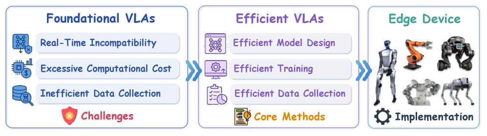
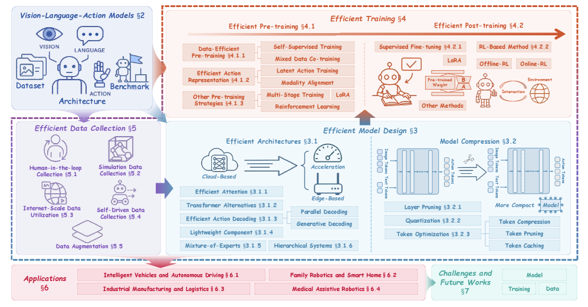
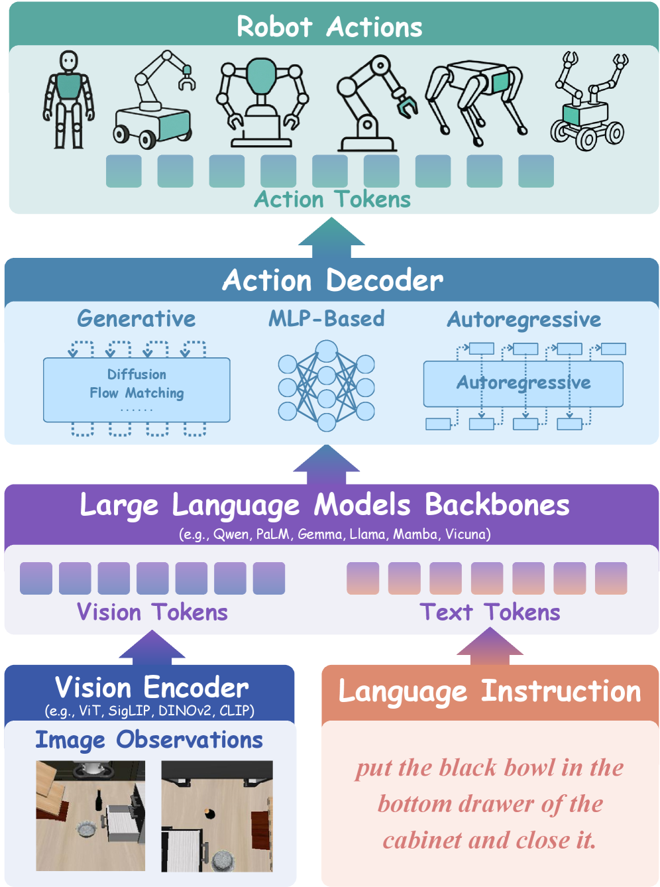
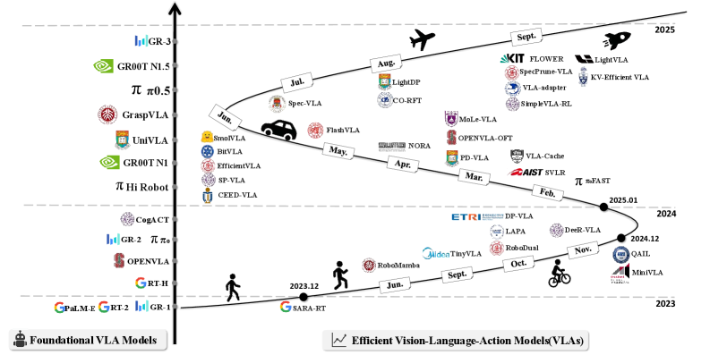
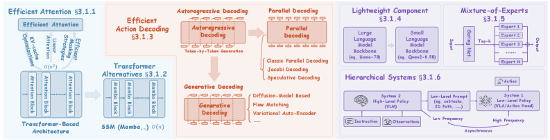
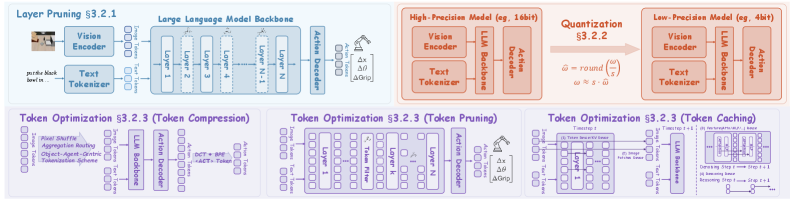
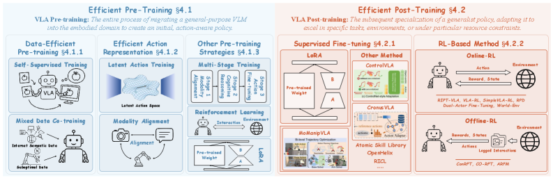
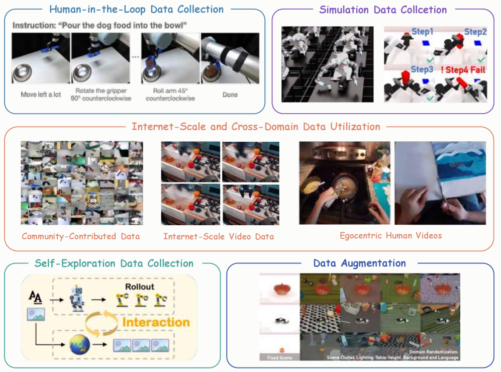

## Summary

> [!summary] A Survey on Efficient Vision-Language-Action Models
> - **核心**: 首个系统性综述围绕「Efficient VLA」主题，沿 model-training-data 三支柱组织近两年 ~100+ 方法，试图把碎片化的加速/压缩/数据节约工作收进一个统一分类。
> - **方法**: 三支柱 taxonomy——(1) Efficient Model Design（efficient architecture + model compression）；(2) Efficient Training（efficient pre-training + efficient post-training）；(3) Efficient Data Collection（human-in-the-loop / simulation / internet-scale / self-exploration / augmentation）。每支柱配 Discussion 小节讨论 innovation & limitation。
> - **结果**: 把 SARA-RT、OpenVLA-OFT、RoboMamba、FAST、TinyVLA、SmolVLA、pi0、LAPA、SimpleVLA-RL、VLA-RFT 等典型方法归到细粒度子类，并附四张表格汇总 representative works。
> - **Sources**: [paper](https://arxiv.org/abs/2510.24795) | [website](https://evla-survey.github.io/) | [github](https://github.com/YuZhaoshu/Efficient-VLAs-Survey)
> - **Rating**: 1 - Archived（6 个月 14 citations / 0 influential / 149 stars / 仓库 107 天未推进；作为 efficient VLA 入门 reading list 有价值，但 taxonomy 深度和批判性不足，很快会被同主题后来者取代）

**Key Takeaways:**
1. **三支柱 taxonomy 是本综述的主要结构贡献**：Model / Training / Data 对应 VLA 部署的三大成本瓶颈（参数 & latency / 算力 & 样本 / 数据采集）。
2. **VLA 特有 efficiency 痛点**：VLM backbone 量级（RT-2-PaLI-X 55B / OpenVLA 7B）导致控制频率只有 1-6 Hz，远低于机械臂实时控制所需的 20-50 Hz；pi0 / GR00T N1 的 2-3B 参数规模+并行解码把频率推到 20-50 Hz，是当前 efficient VLA 的主流目标区间（见 Tab. I）。
3. **Efficient Architecture 的六个子类**：efficient attention、transformer alternatives（Mamba 系）、efficient action decoding（parallel / generative）、lightweight components、MoE、hierarchical systems（System-1/2 解耦）。
4. **Model Compression 三板斧**：layer pruning、quantization、token optimization——后者（token pruning / caching / merging）在 VLA 语境下最活跃，因为 visual token 是序列长度的主要贡献者。
5. **Efficient Pre-training 的核心主线是压缩 action 空间**：LAPA / RynnVLA / LAWM 用 autoencoder 蒸 latent action；FAST 用 DCT+BPE 直接在序列域压缩；这和 data-efficient 的 egocentric video pretraining 是互补的两条路径。
6. **关于作者对"pre-training vs post-training"的重定义**：综述把"从 VLM 迁移到 action-capable policy"全部叫 pre-training（包含 LoRA 等通常被叫做 post-training 的方法），把"对具体任务做 specialization"叫 post-training——这个切分 VLA-centric 但在和主流 LLM 文献对话时会混淆。

**Teaser. 三支柱 taxonomy 鸟瞰图。** 作者把 efficient VLA 的所有方法折叠进 3 个顶级支柱、10+ 二级子类，是全文的主线图。

**Figure 1. Taxonomy overview（三支柱 + 示意图标）**

**Figure 2. 完整 taxonomy 树（方法-子类对应关系）**

---

## 2 Vision-Language-Action Models 背景

### 2.1 VLA Foundational Pipeline

VLA 的标准架构可拆成三个模块：vision encoder → LLM backbone → action decoder。

**Figure 3. VLA 三段式管线：Vision Encoder / LLM Backbone / Action Decoder**

**Equation 1. Vision Encoding**

$$
\mathbf{v} = E_{img}(I; \theta_{img})
$$

**Equation 2. LLM Backbone 融合**

$$
\mathbf{h} = \mathrm{LLM}(P(\mathbf{v}, \mathbf{l}); \theta_{LLM})
$$

**Equation 3. Action Decoding**

$$
\mathbf{a}_{1:T} = D_{act}(\mathbf{h}; \theta_{act})
$$

Vision encoder 常用 ViT / SigLIP / DINOv2 / CLIP；LLM backbone 跨 Qwen / PaLM / Gemma / Llama / Mamba / Vicuna；action decoder 三种流派：diffusion/flow matching、autoregressive token decoding、MLP head。

### 2.2 为什么需要 Efficient VLA

作者用 Tab. I 把问题讲清楚——主流 VLA 的参数量和控制频率严重不匹配实时 robotics：

**Table 1. 代表 VLA 的效率指标**

| Model | Params (↓) | Infer. Latency (ms) (↓) | Freq. (Hz) (↑) |
| --- | --- | --- | --- |
| RT-2-PaLI-X | 55B | 330–1000 | 1–3 |
| RT-2-PaLI-X | 5B | 200 | 5 |
| OpenVLA | 7B | 166 | 6 |
| π0 | 3.3B | 73 | 20/50 |
| HiRobot | 3B | 73 | 10/50 |
| GR00T N1 | 2.2B | 63.9 | - |

> ❓ 表格引用的是论文自报频率，没统一硬件口径（π0 的 50 Hz 是 chunk-level 而不是 token-level），这是行业普遍问题但综述没拆明白。

**Figure 4. Foundational VLA vs Efficient VLA timeline**：2023-2025 两条并行发展曲线，Efficient VLA 自 2024 下半年起进入爆发期。

### 2.3 与其它 VLA Survey 的差异

作者列了 6 篇已有 VLA survey（Ma et al., Shao et al., Xiang et al., Zhong et al. 等），声称已有 survey 只是顺带提及 efficiency，而没有以 efficiency 为主轴做统一 taxonomy。这个 claim 在 2025-10 时大体成立，但 2510.17111（Efficient VLA for Embodied Manipulation: A Systematic Survey）和本文几乎同时发布，是直接竞争。

---

## 3 Efficient Model Design

**Figure 5. Efficient Architecture 六子类**：(a) efficient attention；(b) transformer alternatives；(c) efficient action decoding；(d) lightweight component；(e) MoE；(f) hierarchical systems。

### 3.1 Efficient Architectures

**3.1.1 Efficient Attention.** 三轴优化：linear-time attention（SARA-RT 用 up-training 把 quadratic transformer 转成 linear-attention）、efficient masking（Long-VLA 的 phase-aware masking、dVLA 的 prefix attention + KV cache）、KV-cache optimization（RetoVLA 用 register token 复用，KV-Efficient VLA 用 RNN-gated chunked KV）。

**3.1.2 Transformer Alternatives.** 以 Mamba 为代表的 SSM：RoboMamba 首次把 Mamba 作为 VLA language backbone；FlowRAM 把 region-aware Mamba 耦合 conditional flow matching。

**3.1.3 Efficient Action Decoding.** 当前最活跃的子方向，两条路线：

- **Parallel Decoding**：[[2502-OpenVLA-OFT|OpenVLA-OFT]] 用 bidirectional attention 取代 causal mask，单前向预测 K 长度 action chunk；PD-VLA 把 AR decoding 改写为 Jacobi 迭代的 fixed-point 方程；CEED-VLA 在 PD-VLA 基础上做 early-exit 和 consistency distillation；Spec-VLA 引入 speculative decoding 并放宽 acceptance。
- **Generative Decoding**：TinyVLA 把 Diffusion Policy 作为专用 decoder；HybridVLA 把 diffusion 和 AR 合并到单个 transformer，DDIM 压到 4 步；FreqPolicy 用频域一致性做 flow-based policy；FlowRAM / NinA 用 flow matching / normalizing flow 做单步生成；VQ-VLA / Discrete Diffusion VLA 在 discrete token 空间内做 diffusion refinement。

**3.1.4 Lightweight Component.** 直接减参数量：RoboMamba 的 3.7M MLP head（占总参数 0.1%）；TinyVLA 的 <1.4B VLM；EdgeVLA / MiniVLA 用 Qwen2-0.5B + SigLIP + DINOv2 组出 1B 模型；CLIP-RT 用冻结 CLIP 做 unified encoder，参数是 OpenVLA 的 1/7 却超过 24% 成功率；[[2506-SmolVLA|SmolVLA]] 主打单卡训练；NORA 用 Qwen2.5-VL-3B + FAST+ tokenizer。

**3.1.5 Mixture-of-Experts.** GeRM 首次把 sparse MoE 用到 quadruped RL；FedVLA 提出 Dual Gating MoE（DGMoE）的双向 token-expert affinity；TAVP 用 Task-Aware MoE 把任务-task routing 解耦。

**3.1.6 Hierarchical Systems.** 借用 dual-process theory（System 1/2）：HiRT、DP-VLA、[[2506-SmolVLA|SmolVLA]] 用低频 VLM 指导高频 policy；RoboDual 把 [[2406-OpenVLA|OpenVLA]] 作为 high-level planner，加轻量 DiT specialist 做 latency-aware 协同；HAMSTER 用 2D trajectory sketch 桥接 high-level VLM 和 low-level policy；FiS 用参数共享融合 System 1/2；MinD 用低频 world model + 高频 diffusion policy。

### 3.2 Model Compression

**Figure 6. Model Compression 三子类**：layer pruning / quantization / token optimization（compression / pruning / caching）。

**3.2.1 Layer Pruning.** DeeR-VLA 的 multi-exit dynamic early termination；MoLe-VLA 的 spatial-temporal layer skipping；[[2506-SmolVLA|SmolVLA]] 直接砍 L/2 层；EfficientVLA 做 training-free 跨层 redundancy 分析；RLRC 用 RL 在 pruning 之后恢复性能；FLOWER 用 modality fusion 腾出 50% LLM 层给 diffusion head。

**3.2.2 Quantization.** [[2406-OpenVLA|OpenVLA]] 证明 7B VLA 可直接 int8 量化不掉点；QAIL 做 quantization-aware imitation learning；FAST 用 DCT-based tokenization 让 high-frequency action 更易量化；BitVLA 把 vision encoder 蒸到 1-bit ternary；SQAP-VLA 把 quantization 和 token pruning 联合设计。

**3.2.3 Token Optimization.** 本综述认为是 VLA 压缩的最活跃子方向：
- **Pruning**：FlashVLA / LightVLA（Gumbel-softmax 可微分 token selection）/ SpecPrune-VLA / CogVLA（FiLM-routed instruction-driven pruning）/ ADP / Oat-VLA（object-centric + gripper-guided）。
- **Caching**：VLA-Cache 做 task-aware static visual token caching；HybridVLA 在 diffusion 前缓存 KV；Fast ECoT 在多 timestep 缓存 high-level reasoning tokens；CronusVLA 用 FIFO motion feature queue。
- **Compression**：[[2506-SmolVLA|SmolVLA]] 用 pixel shuffle 把每帧 visual token 压到 64；VOTE 用单个 `<ACT>` token 取代 action chunk。

### 3.3 Discussion（综述作者的观点）

**Innovation**：从 scaling-centric 转向 adaptive 架构，compression + 蒸馏保 perceptual-motor invariant。

**Limitation**：aggressive compression 易造成 semantic drift；hierarchical/parallel 框架有 spatiotemporal coherence 问题；依赖 static importance metric 限制环境适应性——需要 hardware-algorithm 协同设计。

> ❓ Discussion 写得比较 high-level，没有具体方法的失败案例；例如 "semantic drift 在哪个任务 / 哪个模型上被实证出来过？" 没有 ground。

---

## 4 Efficient Training

**Figure 7. Efficient Training 两阶段**：(a) Efficient Pre-Training（data-efficient / action representation / 其它）；(b) Efficient Post-Training（SFT / RL）。

### 4.1 Efficient Pre-Training

作者对 pre-training / post-training 的切分是 VLA-centric——**"把 general VLM 迁移成 action-capable policy" 都叫 pre-training**，不管用的是 LoRA 还是 full FT；"对具体任务做 specialization" 才叫 post-training。这个切分在 VLA 语境下合理，但和主流 LLM literature 冲突。

**4.1.1 Data-Efficient Pre-training.** 两类：self-supervised training（从 expert trajectory 或 egocentric video 提信号）和 mixed-data co-training。

**4.1.2 Efficient Action Representation.** 是本综述的一条重要主线——
- **Action space compression**：LAPA / Bu et al. / RynnVLA-001 / LAWM 都基于 autoencoder 蒸 latent action（前二用 VQ-VAE，RynnVLA 用 VAE，LAWM 从 DreamerV3 world model 提 latent）；FAST 用 DCT+BPE 做序列域压缩（5× 预训练时间缩减）。
- **Innovative action modeling**：EgoVLA 用 MANO 参数做 human-robot 共享 action space；VLA-Adapter 用 Bridge Attention；cVLA 在 image coordinate 而非 robot base frame 做 action encoding；ReSET 把 action state distribution 压成 anchor state set。

**4.1.3 其它 Pre-training Strategies.** Multi-stage training（RoboMamba / DexVLA 等）；RL-based pre-training（GeRM 的 CQL / TAVP 的伪环境）；LoRA adapter 注入。

### 4.2 Efficient Post-Training

**4.2.1 Supervised Fine-tuning.** [[2406-OpenVLA|OpenVLA]] 系统比较 5 种策略证明 LoRA 最平衡；[[2502-OpenVLA-OFT|OpenVLA-OFT]] 进一步把 parallel decoding + action chunking + L1 regression 整合；InstructVLA 把 LoRA adapter 和 MoE-adaptation head 合并；MoManipVLA 用 50 条 real demo 做 bi-level trajectory optimization 迁移到移动操作；ControlVLA 用 ControlNet-style zero-init projection 做 10-20 shot 适配；OpenHelix 只训练一个 `<ACT>` token embedding 冻结 MLLM；RICL 把 In-Context Learning 引入 VLA post-training。

**4.2.2 RL-Based Methods.**
- **Online RL**：RIPT-VLA 用 sparse binary reward + rejection-sampled PPO，15 iter 把成功率从 4%（SFT）拉到 97%；VLA-RL 把 trajectory 当多轮对话，用 VLM-derived dense reward；SimpleVLA-RL 基于 OpenVLA-OFT + GRPO，1 traj/task 从 17.3% → 91.7%；RPD 用 MSE-aligned PPO 把 teacher VLA 蒸到小 policy。
- **Offline RL**：ConRFT / CO-RFT 用 Cal-QL 抑制 OOD value overestimation；ARFM 在 flow matching loss 上自适应 scaling，相对 [[2410-Pi0|π0]] baseline +4.5% 多任务 + 11.4% 扰动鲁棒性。

### 4.3 Discussion

**Innovation**：data-thrifty 迁移成主流，latent action + spectral compression 压缩 policy search space，pre-train 和 task specialization 解耦通过 RL 实现精细化。

**Limitation**：human video 和 robot 的 kinematic 差异引入噪声；PEFT 在 multi-stage manipulation 中 representational flexibility 不够；RL 受 reward misspecification + distribution shift 困扰。

---

## 5 Efficient Data Collection

**Figure 8. Efficient Data Collection 五类**：human-in-the-loop / simulation / internet-scale & cross-domain / self-exploration / augmentation。

### 5.1 Human-in-the-Loop

CLIP-RT 用自然语言 interface 替代 expert teleop；GCENT 把人定位成「只在失败时 rewind-and-refine 的 guardian」，实现 one-operator–multiple-robots。

### 5.2 Simulation Data Collection

GraspVLA 的 SynGrasp-1B（billion-frame 合成抓取）；GeRM 的 QUARD-Auto（Isaac Gym 四足）；cVLA 用 ManiSkill；RoboTwin 2.0 用 code-agent 闭环生成双臂数据；ReBot 提出 real-to-sim-to-real（真轨迹 + 多仿真场景 + 真背景 inpainting）；R2R2R 从手机扫描 + 单条 human video 合成大规模数据（不用物理仿真）；RealMirror 用 WebXR 做低延迟 teleop-sim 混合框架。

### 5.3 Internet-Scale & Cross-Domain

- [[2506-SmolVLA|SmolVLA]]：策展 HuggingFace 上零散社区数据，用 VLM 自动生成标签；证明数据量小一个数量级也能 SOTA，关键是质量+多样性。
- **Egocentric video 路径**：EgoVLA 提出"把人当机器人"；RynnVLA-001 用 pose estimation 做自动化 egocentric video curation；EgoScaler 从 egocentric video 抽 6-DoF object trajectory（无需标注）；Being-H0 把粒度提升到精细 hand pose。
- **Video diffusion 桥接 embodiment**：MimicDreamer 用 video diffusion 把人类 demonstration video 转成机械臂视觉；DreamTransfer 用 diffusion transformer 做 multi-view 一致的 robot video generation。
- **第三人称视频**：Humanoid-VLA 从 third-person human-motion video 提结构化信号，扩展可用数据范围。

### 5.4 Self-Exploration

- **Task-agnostic exploration**：AnyPos（ATARA）用 RL 驱动均匀覆盖 end-effector workspace，建立"机器人能做什么"的 kinematic prior。
- **Online RL as data collector**：SimpleVLA-RL 的 generate-evaluate-optimize 循环；DiffusionRLVLA 用 diffusion policy 生成 multi-modal 轨迹（质量超过人类 demo）。
- **World model as virtual environment**：World-Env 用 LIBERO 做 VLM-guided reward RL；VLA-RFT 直接学 data-driven world model 取代高保真物理仿真器。

### 5.5 Data Augmentation

- **Linguistic/semantic**：LLaRA 把 BC dataset 转成 conversational instruction-response；InstructVLA 用 GPT-4o 生成多层级 annotation；RoboChemist 注入 failure-retry scenario。
- **Trajectory/state**：CLIP-RT 的 Stochastic Trajectory Augmentation；ReconVLA 用 Grounding DINO 自动分割 gaze region 做 visual reconstruction 预训练。
- **Visual modality**：ERMV 用 Epipolar Motion-Aware Attention 跨视角/时间一致地编辑 4D 数据。

### 5.6 Discussion

Innovation：从 teleop 转向 compute-driven，跨域 manifold alignment 把 internet-scale human video 当 kinematic proxy。Limitation：sim-to-real 和 embodiment gap 没解决；internet-scale data 缺 precise action label，对高精度任务仍需 in-domain expert supervision。

---

## 6 Applications

四大应用场景：Autonomous Driving（AdaThinkDrive / IRL-VLA / AutoVLA / DiffVLA）、Family Robotics（on-device 隐私）、Industrial Manufacturing（CIPHER 在 3D 打印业做多角色切换）、Medical Assistive（on-premise 数据保密 + 个体化）。内容偏愿景性，方法上未引入新信息。

---

## 7 Challenges & Future Works

沿着 Model / Training / Data 三支柱对应写：
- **Model**：compactness vs expressivity 张力；hierarchical 路由开销；sub-billion 参数下的 long-horizon 退化。
- **Training**：PE-FT 的计算节省 vs representational flexibility 损失；RL 的 high-variance gradient & reward sparsity；action representation compression 扭曲 kinematics。
- **Data**：human collection 贵，synthetic 缺真实感，augmentation 注入 bias，self-exploration 需要 curation。

**Future**：context-aware dynamic token pruning、modality-agnostic backbone、hardware-software co-design；federated + differential privacy、physics-informed pre-training、meta-learning/curriculum；diffusion-guided synthesis、curiosity-driven multi-agent exploration、自我进化的生成式数据生态。

---

## 关联工作

### 基于 / 串起的代表 VLA
- [[2307-RT2|RT-2]]：VLA 范式开端，被综述作为效率基准（55B 参数 / 1-3 Hz）。
- [[2406-OpenVLA|OpenVLA]]：open-source VLA 基线，FT 策略对比、int8 量化示范都绑定在 OpenVLA 上。
- [[2502-OpenVLA-OFT|OpenVLA-OFT]]：efficient action decoding 代表作，parallel decoding + action chunking + L1 regression 的组合范式。
- [[2410-Pi0|π0]] / [[2504-Pi05|π0.5]]：flow-matching 派系的代表，综述用作 latency baseline。
- [[2503-GR00TN1|GR00T N1]]：2.2B 参数大型 humanoid VLA，综述里是效率-能力平衡的正面例子。
- [[2506-SmolVLA|SmolVLA]]：几乎每一节都出现——lightweight component / layer pruning / visual token compression / internet-scale 数据策展。
- [[2502-HiRobot|Hi Robot]]：hierarchical 系统的代表（与 HAMSTER 同一思路）。

### 对比 / 同主题 survey
- Ma et al. 2024 VLA Survey：更广义的 VLA 综述，作者指出其未以 efficiency 为主轴。
- **2510.17111**（Efficient VLA for Embodied Manipulation: A Systematic Survey）：与本综述几乎同时发布、高度重叠，缺乏互相比较和 positioning 是本文的一个弱点。
- [[2507-VLATokenizationSurvey|VLA Tokenization Survey (2507.01925)]]：从 action tokenizer 角度切分 VLA，和本综述 Section 4.1.2 的 "efficient action representation" 高度相关但视角更聚焦。

### 方法相关（综述中核心技术的原始出处）
- Mamba / SSM：RoboMamba / FlowRAM 的骨干。
- VQ-VAE：LAPA、VQ-VLA 的 action tokenizer 原型。
- **Diffusion Policy**：TinyVLA / HybridVLA / FlowRAM 生成式解码的基础。
- **LoRA**：几乎所有 PEFT 路线的核心。
- **FAST action tokenizer**：频域 + BPE 的 action 压缩，综述同时归入 action representation 和 quantization。

---

## 论文点评

### Strengths

1. **Timing 合适**：2024H2 起 efficient VLA 工作爆发，综述为社区提供一个及时的 reading list 和 taxonomy 骨架。附带 GitHub 维护 paper list（149⭐）比综述本身的延伸价值更高。
2. **三支柱 taxonomy 涵盖面够全**：model / training / data 的切分对应 VLA 部署的实际成本结构，比"按算法类型"切分更有工程导向性。每个支柱下的二/三级子类划分合理，能帮读者快速定位方法。
3. **Efficient Action Decoding 子章节是亮点**：把 parallel decoding（Jacobi、speculative、bidirectional attention）和 generative decoding（diffusion、flow matching、VQ、normalizing flow）对齐讨论，揭示"action 生成速度"这条主线。
4. **Table I 直接对比 VLA 的 params / latency / freq**：给读者 grounded 的数量级参考（而不是抽象的 "efficient"），这是很多综述缺的。

### Weaknesses

1. **写作风格过度修辞**（"herald"、"ethos"、"thrift"、"curtail"、"transmute" 充斥全文），信息密度被稀释；中文读者和非母语作者阅读成本高。更糟的是这种风格掩盖了对方法的具体分析——很多段落读完记不住技术要点，只记得形容词。
2. **Critical depth 不足**：Discussion 小节虽然每章都有 Innovation / Limitation，但都是泛泛而谈（"semantic drift"、"reward misspecification"），没有引用具体论文的 failure case、没有横向定量对比（例如同一 benchmark 上不同 compression 方法的 success rate vs speedup 曲线）。
3. **与并行综述的 positioning 缺失**：2510.17111（几乎同时）、2507.01925（action tokenization 视角）、2502.06851 都在同主题，作者在 Related Surveys 仅列名未对比差异。对读者选哪本看缺乏引导。
4. **Pre-training / Post-training 的重定义引入新的混淆**：VLA-centric 的切分把 LoRA 归入 pre-training，读者在和通用 LLM 文献对话时会绊倒。与其重定义术语，不如在现有术语下新增一个维度（如 "VLM→VLA migration" vs "task specialization"）。
5. **Rating 指标弱**：发布 6 个月 / 14 citation / 0 influential / github 149⭐ / 仓库 107 天未推进（pushed_at 2026-01-05）/ 90d commits=0，说明社区在用它的 reading list 而不在引用分类学本身；综述的核心贡献（taxonomy）很难被量化继承。

### 可信评估

#### Artifact 可获取性
- **代码**：仓库 [YuZhaoshu/Efficient-VLAs-Survey](https://github.com/YuZhaoshu/Efficient-VLAs-Survey) 是 paper list（markdown）；综述本身不涉及代码实验。
- **模型权重**：N/A（综述类）。
- **训练细节**：N/A（综述类）。
- **数据集**：N/A（综述类）。

#### Claim 可验证性
- ✅ **"是第一个聚焦 efficient VLA 的 survey"**：在 2025-10 发布时间点大体成立；并行 survey 2510.17111 仅早 10 天，重合度高但 scope 不同（manipulation-only vs 全 VLA）。
- ⚠️ **"三支柱 taxonomy 是 unified framework"**：分类本身合理，但"统一"略 overclaim——多数方法同时触及 2-3 个支柱（如 FAST 同时是 action representation、quantization、token compression），综述用重复列举处理，taxonomy 的正交性不强。
- ⚠️ **Tab. I 的 latency / frequency 数字**：来自各自原论文自报，硬件和 chunk-level vs token-level 的口径不一，直接对比有误导性。
- ❌ **"establishes a foundational reference for the community"**：abstract 中的自评，属于 marketing 修辞。是否 foundational 由引用模式决定，当前 metrics 还不支持。

### Notes

- 这篇综述对我的价值：作为 efficient VLA 方向的 "paper index"——我可以用它的 Tab. II/III/IV/V/VI 快速定位某类方法的代表作。但要理解具体方法还是要看原论文。
- Efficient action decoding（尤其 parallel + generative 的融合）是我关心的 VLA 方向中 ROI 最高的加速路线，值得单独开 topic 深挖。
- **Pattern**：综述里反复出现的一个信号是 "3B 参数 + 20-50 Hz" 正在成为 deployable VLA 的新工程基线（π0、GR00T N1、SmolVLA），7B+ 在实时控制场景已显偏大——后续挑选论文可以这个阈值做 filter。

### Rating

**Metrics** (as of 2026-04-22): citation=14, influential=0 (0%), velocity=2.3/mo; HF upvotes=6; github 149⭐ / forks=6 / 90d commits=0 / pushed 107d ago

**分数**：1 - Archived

**理由**：发布 6 个月 14 citation / 0 influential / velocity 2.3/mo 对一篇综述偏低；149 GitHub stars 说明社区在用它的 reading list 而非引用 taxonomy 本身，且仓库 90d 无 commit（pushed 107 天前）显示作者维护动力已衰减。同方向的并行综述（2510.17111、2507.01925）也压缩了它成为 de facto reference 的窗口。之所以还不是"完全无价值"——作为 efficient VLA 2024-2025 这个时间切片的分类 index 有即时查询价值，值得升到 Frontier 档；但作为知识结构本身，taxonomy 的正交性、critical depth、positioning 都撑不起 Frontier 或 Foundation。综合上述：**1 - Archived**——作为 Paper index 查阅时拿出来用，不在主脉络中。
