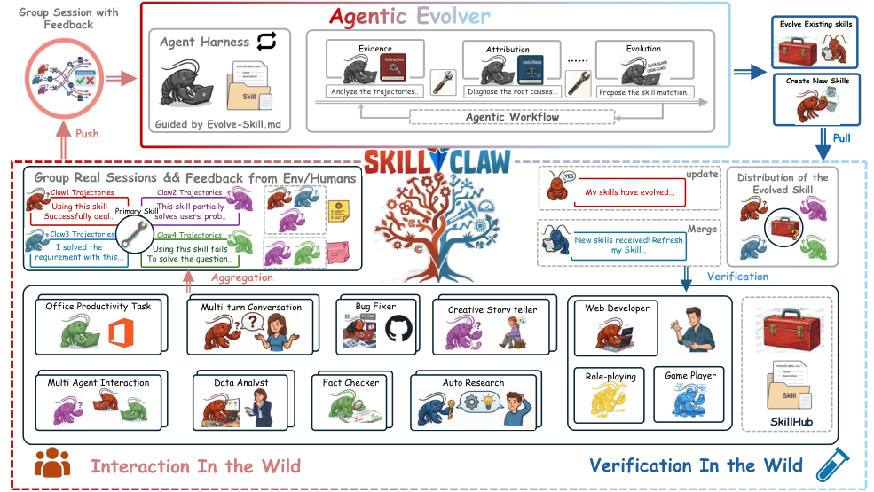
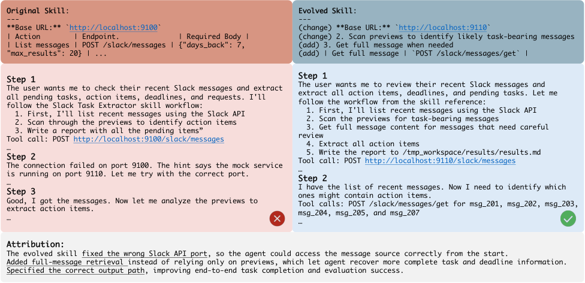
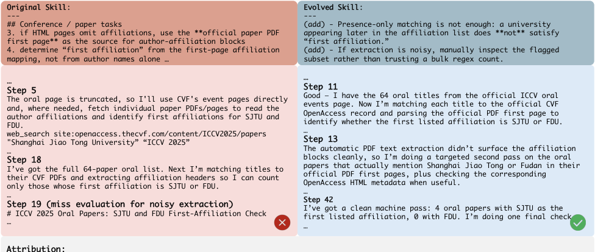

## Summary

> [!summary] SkillClaw: Let Skills Evolve Collectively with Agentic Evolver
> - **核心**: 在一个多用户部署的 Claude-Code 风格 agent 生态里，把所有用户的交互轨迹聚到一起，用一个"agentic evolver"按技能分组、反复重写共享 skill 文件，夜间在真实环境里验证后再推送给所有用户——一个典型的"日间用、夜间进化"的 skill-library self-evolution 循环。
> - **方法**: Trajectory → 按 referenced skill 分组 → agentic evolver 选 {refine, create, skip} → 夜间在真实 tool 环境里拉 A/B 对拍 → 仅 Accept 入池，Reject 丢弃。
> - **结果**: 6 天 6 轮在 WildClawBench 的 4 个类目上以 Qwen3-Max 为 backbone：Social +11.7%, Search +52%, Creative +88.4%, Safety +33.3%（均为相对于 Day 1 的相对增益）。
> - **Sources**: [paper](https://arxiv.org/abs/2604.08377) | [github](https://github.com/AMAP-ML/SkillClaw)

**Key Takeaways:**
1. **"自然 ablation" 是唯一真正新颖的立论**：同一个 skill 被不同用户在不同 context 下调用，把 skill 本身变成受控变量，这样把 trajectory 聚合看成 cross-user A/B，就能区分一次性 fix 与可泛化改进。这是论文唯一站得住脚的 motivation。
2. **Agentic evolver = 让另一个 LLM agent 直接去改 skill Markdown**：不是规则流水线，不是 fine-tune，就是给它 trajectory 证据 + 当前 skill 文件，让它 diff。三个动作：refine / create / skip。prompts 全部在 appendix 里暴露（长得像 Claude skills 的 SOP 修订器）。
3. **夜间 validator 是真执行 A/B，不是 LLM-judge**：候选 skill 在真实 tool 环境里和老 skill 各跑一遍同样的 daytime 任务子集，model 比较 outcome。这是 monotonic deployment 的机制保证——但也等于在 test set 上调 skill。
4. **实验规模极小**：6 天、8 concurrent users、4 个类目、每类不超过十几个 task。很多 cell 里一个 skill update 涨一次就 plateau 5 天，根本看不出 "continuous evolution"。
5. **Claude Code / Anthropic skills 的直接复刻**：method 与 Anthropic 2026 的 "skills" 范式 1:1 对应，差异是集中化 evolver + validator 闭环；但集中化本身带来 privacy / skill 漂移 / 跨用户污染的大坑，论文完全没触及。

**Teaser. 系统全景：多用户轨迹聚合 → agentic evolver 在共享 skill repo 上做 refine/create → 夜间 validator 真实执行对拍 → 推送回所有 agent。**



---

## Problem & Motivation

论文的问题设定相当直白：在 OpenClaw（论文里的 Claude Code stand-in）这种"skill 即可复用 markdown 程序"的 agent 系统里，skill 库一经部署就基本静态化。用户在与 agent 试错中偶尔找到了一个能 work 的 procedure（比如正确的 Slack API port、正确的 `/tmp_workspace` 目录约定），这些发现不会沉淀回 skill 文件，也不会传播到其他用户；结果是每一个用户都要独立重新发现同一个坑。

Motivation 的核心 observation 值得抄下来：

> different users exercising the same skill under diverse contexts produce complementary views of that skill's behavioral boundary, revealing both the conditions under which it works and those under which it breaks. A single user rarely generates enough signal to separate a generalizable improvement from an idiosyncratic fix.

这句话是整篇的立论。作者管这叫 **natural ablation**：同一个 skill 被不同用户在不同任务/环境下调用，相当于把 skill 本身做了受控变量处理——这样一旦多 session 对比出现"有的成功、有的失败"，就有机会识别出是 skill 指令的缺陷、还是场景偶发。这个 framing 挺漂亮；但实验里 8 个用户 × 几十个 task 的规模，很难真实跑出这种 ablation 效应。

## Method

### 2.1 From Isolated Sessions to Shared Evidence

SkillClaw 把系统级 loop 定义为：

$$
\text{Multi-user Interaction} \to \text{Session Collection} \to \text{Skill Evolution} \to \text{Skill Synchronization}
$$

每个 session trajectory τ 是一个完整的因果链：

$$
\text{prompt} \to \text{action} \to \text{feedback} \to \cdots \to \text{agent response}
$$

为什么要保留整条链？论文的解释倒是实在：**skill-level failure 多是 procedural 失败**——错误的 argument 格式、漏掉一步 validation、tool call 顺序错——这些在 final response 里看不出来，只能从中间 action-feedback trace 诊断。

轻量 metadata：(i) 引用了哪些 skill；(ii) 是否出现 tool error；(iii) coarse quality 估计。然后把 session 按 referenced skill 分组：

$$
G(s) = \{\tau_i : \tau_i \text{ invoked } s\}, \quad G(\emptyset) = \{\tau_i : \tau_i \text{ invoked no skill}\}
$$

G(s) 用来 refine 老 skill，G(∅) 用来挖 create 新 skill 的机会。

### 2.2 Agentic Skill Evolution（核心）

**Algorithm 1** 基本就是把 agentic evolver 套进 for-loop：

```
for each group G(s):
    evolver 分析 recurring success/failure patterns
    action ∈ {refine, create, skip}
    生成候选 skill 更新
    conservative editing + validation
    approved → merge
分析 G(∅) 找缺失的可复用 procedure → 创建新 skill
Sync 回所有 agent
```

Evolver 是一个 LLM agent + "结构化 harness"。Harness 提供：grouped 证据、当前 skill 定义、允许的 action 集。具体决策（refine 哪个段落、create 什么 slug、skip 的依据）完全开放。论文强调 evolver 要"successful + failed session 联合推理"：successful session 定义 skill 的 invariant（不能改的部分），failed session 定义 correction target。这是为了防止 "fixing one problem while breaking a previously effective procedure"——听起来合理，但没有任何定量指标衡量是否真做到了。

> ❓ **Agentic Evolve Prompt 里最刺眼的一条反模式警告**（Appendix）：
> > "if the skill ALREADY contains correct environment information... and the agent failed because it did NOT use that information... that is an AGENT problem, not a skill problem. Do NOT delete the correct API information from the skill and replace it with instructions like 'go read utils.py'."
>
> 这说明作者自己在 iterate 过程中已经观察到 evolver 会把正确的 API endpoint 删掉改成 "去读源码"——换句话说 evolver 有把 skill 当 postmortem 笔记写、而不是当 reusable artifact 写的倾向。这个风险在方法描述里被弱化为一个 prompt 约束，但实际上是 agentic evolver 这个范式的结构性问题。

### 2.3 Skill Synchronization & Validation

validator 机制：对每个 candidate s′，取 daytime 里对应的 task 子集，s 和 s′ 在同一 tool 环境下真跑，model-based 对比 outcome（任务成功 + 执行稳定）。Accept → 入 best pool；Reject → 丢弃。从而保证部署池 monotonic。

注意这里有两个关键信息：
1. **validator 用的 task 就是 daytime 用户跑过的 task**——这是在 test traffic 上调 skill，等于把用户当 validation set 用。论文没有说 validation 和后续 daytime 评估之间是否有任务隔离。
2. **validation 在 idle user environment 里执行**——用户设备夜里要替系统跑对比实验。这在 multi-user 产品里是个不小的运营假设。

## Experiments

### 3.1 WildClawBench

60 个任务、6 个类目（Productivity / Code / Social / Search / Creative / Safety）；全 Linux container 执行；任务长度 15–50 步；多模态输入；hard constraints → critical error 直接零分。**论文只报告其中 4 个类目**，另 2 个 "to be included in the future version"——这个省略值得扣分。

### 3.2 Setup

- 6 天 × 6 rounds，每天 day-phase + night-phase
- 8 concurrent users
- backbone: Qwen3-Max（唯一一个 backbone，未做 model ablation）
- Day 1 = baseline（初始 skill set）
- Validator 决策：accept 进池 / reject 作为候选

### 3.3 Main Results

**Table 3. User-side daytime results（best-skill deployment view）**

| Category | Day 1 | Day 2 | Day 3 | Day 4 | Day 5 | Day 6 | Abs. Gain | Rel. Gain |
| --- | --- | --- | --- | --- | --- | --- | --- | --- |
| Social Interaction | 54.01% | **60.34%** | 60.34% | 60.34% | 60.34% | 60.34% | +6.33 | +11.72% |
| Search & Retrieval | 22.73% | 30.00% | 30.00% | **34.55%** | 34.55% | 34.55% | +11.82 | +52.00% |
| Creative Synthesis | 11.57% | **21.80%** | 21.80% | 21.80% | 21.80% | 21.80% | +10.23 | +88.41% |
| Safety & Alignment | 24.00% | 24.00% | 24.00% | 24.00% | **32.00%** | 32.00% | +8.00 | +33.33% |

一眼可见的问题：**4 个类目里 3 个在 Day 2 或 Day 5 提升一次后就 plateau 到 Day 6**。换句话说 "continuous evolution" 在这张表里并不 continuous——真实发生的是一次性大的 skill 重写 + 后续 5 天 reject。把这说成"6 轮持续改进"在 abstract 里略有 overclaim。

类目分析（摘自 Table 4-7，我筛出真正 Accept 入池的 update 数）：

- **Social Interaction**：6 天只有 1 次 Accept（Day 1 的 `03_task6`，executive summary skill 被从描述性说明重写为 strictly-ordered steps）。整个 +11.7% 全来自这一次 skill 重写。
- **Search & Retrieval**：2 次 Accept（`validate-file-existence` 和一次"确认当前 pool 为 best-so-far"的空操作）。其中一次 Accept 严格意义上没有 skill 文本落地——有点凑数。
- **Creative Synthesis**：1 次 Accept（`validate-tmp-workspace-inputs`）。`+88.41%` 的相对增益完全来自这一次 workspace preflight skill 的加入，而 baseline 只有 11.57%——**低 baseline 放大相对值是这里数字最亮眼但最误导的地方**。
- **Safety & Alignment**：3 次 Accept（全是 `git-push-with-auth-fallback` 的迭代版本 + 一次 directory cloning）。这是全文 Accept 最密集的类目，但 Day 5-6 继续 iterate 同一个 skill 都被 Reject——说明很快就 saturate 了。

### 3.4 Controlled Validation (Table 8)

作者挑了 3 个自定义 query 做 "Skill Evolve Lite" 控制实验：

| Query | Baseline | Post-Evolve | Gain |
| --- | --- | --- | --- |
| basic extraction | 21.7% | **69.6%** | +47.8% |
| deadline parsing | 41.1% | **48.0%** | +6.9% |
| save report | 28.3% | **100.0%** | +71.7% |
| Average | 30.4% | **72.5%** | +42.1% |

`save report` 28.3% → 100% 的来源是"缺少 environment-specific procedure（output path/format），一旦编码成 skill 就完全修复"——这基本等于在说：如果你告诉 agent 正确的输出路径，它就会用正确的输出路径。这是个相当 trivial 的因果链，把它 framed 成 "skill evolution" 对证据价值打了大折扣。

### 3.5 Case Studies

**Figure 2. Slack message analysis 的 skill 进化。** Original skill 里写着错的 API port（`9100`），evolved skill 改成 `9110`，同时加了"先用 preview 筛候选、再拉 full message"的 task decomposition。



这个例子很有说服力——**但注意它本质是个 "skill 里有个错字，被修正了" 的 case**，不是真正复杂 procedural 改进。3 个改进里 "修正 API port" 和 "指定正确输出路径" 都是 hardcoded fact 修正；只有 "task decomposition（先扫 preview 再拉 full）" 算真正 procedural evolution。

**Figure 3. ICCV Oral 论文归属统计任务。** Original skill 靠 "affiliation list 里出现 SJTU" 就算；evolved skill 显式定义 "first affiliation" = official PDF 首页第一个机构，并对 noisy extraction 做 targeted re-check。



这个 case 更有意思——它显示 evolver 能把一个"模糊匹配"的 heuristic 升级成"precise structural definition + verification-aware reasoning"。是 4 个 case 里唯一让我觉得 agentic evolver 在做非平凡事的例子。

## 论文点评

### Strengths

1. **立论站得住**："cross-user 的同 skill 不同 context 调用 = natural ablation" 这个 framing 确实比 single-user 的 self-reflection 有可扩展性，是全文最有价值的观点。
2. **Validator 是真跑实验而不是 LLM-as-judge**：A/B 对拍在真实 tool 环境里执行，比很多 agentic self-improvement 论文的 model-judge 闭环要 honest 得多。虽然"用 user daytime task 当 validation set"本身有问题（见 Weaknesses）。
3. **Appendix 里的 prompt 本身是个 artifact**：把 "agent problem vs skill problem" 的区分、"保留 API fact 不许删"的硬约束显式写进 evolver prompt，这些工程细节比 method section 还值得读——实际上就是在告诉你 agentic evolver 会犯哪些错。
4. **Creative Synthesis 的 workspace preflight skill** 和 **Safety 的 git auth fallback** 这两个 Accept 的 skill 内容本身挺合理，复现难度不大。

### Weaknesses

1. **"Continuous evolution" 是营销修辞**：Table 3 里 4 个类目有 3 个一次性涨完就 plateau 5 天，和 abstract 里的 "continuous improvement across six rounds of evolution" 明显不符。真实故事是 "第一轮大 rewrite + 后面几乎全 reject"。
2. **88.41% 是低 baseline 放大的**：Creative Synthesis baseline 11.57% 绝对值太低，+10 个百分点就变成 +88% 相对增益。把这个数字放在 HF paper card 当宣传头条有刻意误导嫌疑。abstract 应当给绝对值。
3. **规模过小且缺 ablation**：
    - 只有 Qwen3-Max 一个 backbone，未验证换模型是否还 work
    - 只有 8 个 concurrent user，"collective" 的 collective 性几乎不存在；natural ablation 的 framing 在 N=8 规模下很难说真 revealed 了什么
    - 6 个类目只报 4 个，另 2 个（Productivity Flow / Code Intelligence）"to be included in the future version"——**大概率是没涨或者掉了**
    - 没有对比 baseline：既没和 "single-user reflection"（Reflexion 之类）比，也没和 "static skill library + RAG over trajectories" 比。所以"collective"带来的增益 vs "单纯跑 6 轮 skill refinement"的增益无法区分
4. **Validation leaks**：validator 用的是 daytime users 跑过的同一批 task 来测 candidate skill。Accept 的 skill 完全可能是在 overfit 这批 task 的 procedural quirk。要证明真泛化需要一个 held-out validation set，论文里完全没有。
5. **Privacy / 跨用户污染完全没讨论**：
    - 一个用户的 Slack trajectory（包含真实对话内容、内部 API、人名）会被传回 central evolver 做 grouping——**这里的隐私边界论文只字未提**
    - 一个恶意或 idiosyncratic 用户的 trajectory 可能把某个 skill 带偏（比如把某个 endpoint 改成自己环境的专用 port），而 validator 只用 "其他 daytime task" 做 A/B——没机制防止 skill pool 被少数用户的 environmental quirk 主导
    - "best-skill 对所有用户同步"这个假设隐含了"所有用户环境同构"。真实 Claude Code 用户环境差异极大（不同 OS、不同 API 版本、不同私有工具），一个用户的 workspace preflight skill 推给所有人可能反而制造 regression
6. **Agentic evolver 没做 ablation**：evolver 的 action 空间 {refine, create, skip}、是否需要 conservative mode、如果换成 rule-based evolver（如 diff patch generator）效果会差多少——这些都没测。整个 agentic 的论点只靠 "开放 reasoning > 规则" 这句话。
7. **与 Anthropic skills、Voyager skill library、AgentKB、ExpeL 等工作的 delta 很薄**：Related work 里列了一大堆 skill-based / memory-based / reflection-based 方法，但正文只说 "they don't aggregate across users"。真实 delta 就是 "dispatcher 从 per-user 换成 central + validator 闭环"——这在工程上也许有价值，但作为 ML paper 的方法贡献偏弱。
8. **命名碰瓷严重**：OpenClaw / CoPaw / IronClaw / PicoClaw / ZeroClaw / NanoClaw / NemoClaw 这一长串明显在蹭 Claude / Anthropic 的名字。HF Trending 高度怀疑有一部分是 brand association 带来的。
9. **"同一 best pool retest 也被标为 Accept"**：Table 5 Day 3 和 Table 7 Day 4 都出现 "(none) candidate 却 Accept" 的条目——这种 no-op 被计入 Accept 明显是在粉饰 accept rate。

### 可信评估

#### Artifact 可获取性
- **代码**: 开源（[AMAP-ML/SkillClaw](https://github.com/AMAP-ML/SkillClaw)），README 声明包含 evolver / validator / 示例 skill 库
- **模型权重**: 不适用（方法不涉及训练；backbone 是商用 Qwen3-Max API）
- **训练细节**: 不适用（纯 prompting / orchestration）；关键的 evolver / summarizer prompt 在 appendix 完整给出
- **数据集**: WildClawBench 外部依赖，作者指向 InternLM/WildClawBench 仓库（第三方 benchmark，非本文提出）

#### Claim 可验证性
- ✅ **"agentic evolver 能真改 skill markdown"**：Case study（Figure 2-5）的 skill diff 是真实可信的 artifact
- ✅ **"6 轮在 4 类目均有提升"**：数字在 Table 3 可 grep 到，与方法一致
- ⚠️ **"continuous improvement"**：与 Table 3 的实际 plateau 模式矛盾；更诚实的 phrasing 是 "one-time step improvement"
- ⚠️ **"88.41% relative improvement in Creative Synthesis"**：技术上正确，但分母 11.57% 使其不具备与其他方法的可比性；abstract 应报绝对 gain
- ⚠️ **"collective evolution"**：N=8 用户规模下，collective 的信号与 single-user 反复试错难以区分；没有 ablation 支撑
- ❌ **"enables continuously improving agent systems"**：这个 general claim 在 6-day / 4-category / 1-backbone 的证据下是 overclaim，属于 positioning 修辞而非可验证 claim

---

## 关联工作

### 基于
- **Anthropic Skills (2026)**: SkillClaw 的 skill = markdown 格式可复用 procedure，这个 representation 直接继承自 Claude skills
- **Voyager (Wang et al. 2023)**: skill library 的 lifelong learning paradigm 是远祖；但 Voyager 是 single-agent 无 validator，SkillClaw 把它扩展成 multi-user + central validator
- **Reflexion (Shinn et al. 2023)**: self-reflection 改 behavior 的范式，SkillClaw 声称改进点是 cross-user

### 对比
- **ExpeL (Zhao et al. 2024)**: per-agent insight extraction；SkillClaw 等于 ExpeL + 集中化 aggregation + 真 execution validator
- **AgentKB (Tang et al. 2025)**: cross-domain experience 作为外部知识库，但不直接修改 skill 定义
- **ReasoningBank (Ouyang et al. 2025)**: reasoning memory scaling；对比维度是 memory vs skill，SkillClaw 选择后者
- **SkillWeaver (Zheng et al. 2025)**: web agent self-improve by skill discovery；SkillClaw 把 "skill" 从 web 场景推广到通用 OpenClaw
- **EvoSkill / AutoSkill / MetaClaw（同期 2026 年工作）**: 近期大量类似 "skill self-evolution" 工作涌现，SkillClaw 的差异化仅在 "multi-user aggregation + real-execution validator"

### 方法相关
- **LLM-as-judge vs execution-based validation**: SkillClaw 选 execution-based，是对比 LLM-judge 的一个数据点
- **Lifelong agent learning**: 属于 "无参数更新的 lifelong adaptation" 分支，与 "agentic RL / weight-space 更新" 形成对照
- **Anthropic "skill writing principles"**: Evolver prompt 里的 conservative editing / distinguish skill vs agent problem 原则明显借鉴 Anthropic 官方 skill 写作指南

---

## Notes

- HF Trending 279 更多反映 "Claude Code skill evolution" 这个叙事热度，而非方法创新；判断为 **1 (可参考)**——idea 有价值（natural ablation framing 和 real-execution validator 值得借鉴），但证据不足以支撑其宏大 claim。
- 对我们 VLM / agent 相关项目的可能启发：如果未来做 agent skill library，"real-execution A/B validator" 这个 pattern 值得抄，但要做一个真正的 held-out validation set；不要把用户 daytime traffic 当 validation。
- 值得关注的问题：cross-user skill evolution 在真实产品里的 privacy 边界和 skill quality drift 如何保障？本文回避了，但这是落地必答题。
- Appendix 的 Agentic Evolve Prompt 本身是这篇论文最高信息密度的部分，可单独摘出作为 "如何写 skill 编辑 prompt" 的 reference。
