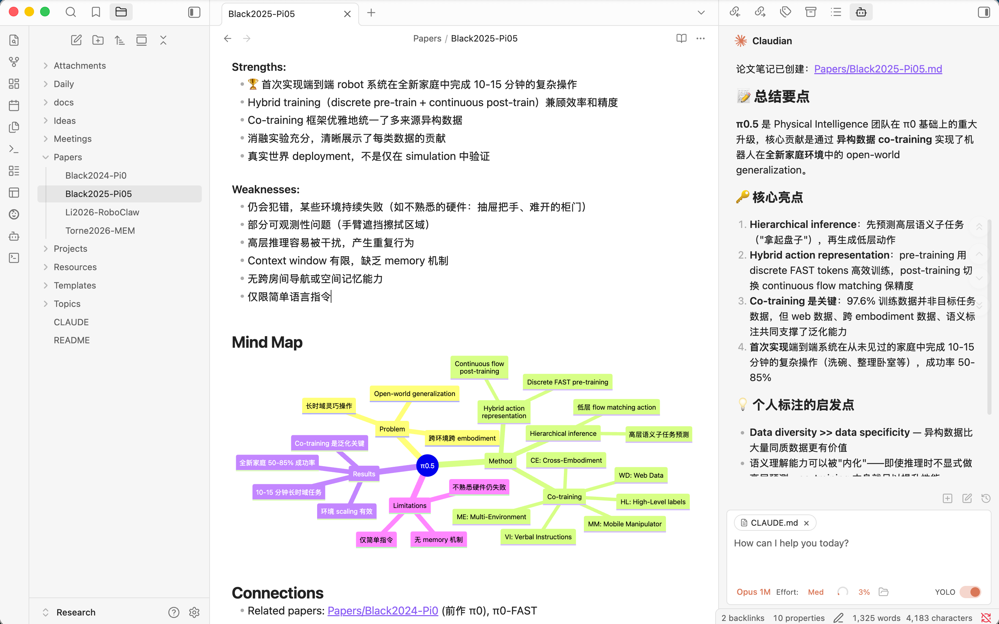

# MindFlow

An Obsidian-based research workspace for building a **human-AI collaborative research pipeline** — from paper reading to idea generation to experiment validation.

基于 Obsidian 的 AI 研究知识管理工作区，构建从论文阅读到 idea 生成再到实验验证的 **human-AI 协作研究流水线**。

## Vision

论文太多，靠人工逐篇阅读不现实。MindFlow 让人和 AI 更好地配合——**人专注于创造性工作，AI 负责重复性、工程性的事情**，共同构建一个 personalized knowledge space。

核心流程：

1. **AI 阅读与总结** — 让 AI 批量阅读论文、生成结构化笔记
2. **人工精炼与补充** — 人来修改、补充个人见解
3. **交互式讨论** — 人和 AI 围绕论文内容深入讨论
4. **知识网络构建** — 逐步积累形成 personalized knowledge space
5. **Research Idea 生成** — 基于知识积累，碰撞产出研究想法
6. **实验设计与验证** — 设计实验方案，跟踪结果，验证假设



## Features

- **Paper Notes** — 结构化论文笔记（108+ 篇），含 Mind Map 与跨论文链接
- **Domain Maps** — 按研究领域构建的认知地图（VLM、CUA、VLA 等）
- **Research Ideas** — 灵感记录与评估，双向链接到相关论文
- **Literature Survey** — 按主题系统调研，多篇论文对比分析
- **AI Skills** — 13 个 AI 技能覆盖完整研究流程（阅读→构思→实验→写作→反思）
- **Workbench** — 研究状态追踪（agenda、日志、记忆库）
- **Project & Meeting Tracking** — 项目进展与会议记录
- **Published Website** — 基于 Quartz v4 的知识库站点

## Getting Started

See [INSTALL.md](docs/INSTALL.md) for detailed installation instructions. You can follow the steps manually, or simply copy the following instruction into your CLI agent:
```
Install MindFlow from: https://github.com/liqing-ustc/mindflow/blob/main/docs/INSTALL.md
```

## Directory Structure

| Folder | Purpose | Naming |
|--------|---------|--------|
| `Papers/` | 论文笔记 | `YYMM-ShortTitle.md` |
| `DomainMaps/` | 核心认知地图，每个 domain 一个文件 | `_index.md` 为索引 |
| `Ideas/` | 研究灵感与评估 | 自由命名 |
| `Topics/` | 文献调研与分析报告 | 主题名称 |
| `Projects/` | 项目追踪 | 项目名称 |
| `Reports/` | 生成的报告 | — |
| `Meetings/` | 会议记录 | `YYYY-MM-DD-Description.md` |
| `Workbench/` | 研究工作状态（agenda、日志、记忆） | — |
| `skills/` | AI 研究技能库 | — |
| `Templates/` | Obsidian 模板 | — |
| `references/` | 协议文档（tag taxonomy 等） | — |

## Templates

| Template | Purpose |
|----------|---------|
| Paper | 论文笔记（含 YAML frontmatter、Mind Map、Connections） |
| Idea | 研究灵感（status: raw → developing → validated → archived） |
| Project | 项目追踪（status: planning → active → paused → completed） |
| Topic | 主题综述/文献对比（含论文对比表格） |
| Survey | 系统文献调研报告 |
| Experiment | 实验设计与跟踪 |
| DomainMap | 认知地图 |
| Report | 研究报告 |
| Meeting | 会议记录（含 Action Items） |
| Daily | 每日研究日志 |

## AI Research Skills

MindFlow 内置了 13 个 AI 技能，按研究流程分为 6 层：

| Layer | Skills | Purpose |
|-------|--------|---------|
| 1. Literature | `paper-digest`, `literature-survey` | 论文阅读与文献调研 |
| 2. Ideation | `idea-generate`, `idea-evaluate` | 研究 idea 生成与评估 |
| 3. Experiment | `experiment-design`, `experiment-track`, `result-analysis` | 实验设计、跟踪与分析 |
| 4. Writing | `draft-section`, `writing-refine` | 论文写作与打磨 |
| 5. Evolution | `memory-retrieve`, `memory-distill`, `agenda-evolve` | 记忆管理与方向演化 |
| 6. Orchestration | `autoresearch` | 自主研究循环 |

### Quick Start with Claude Code

```
总结论文 pi0                    # AI 自动抓取、总结、存储论文笔记
找 idea                        # 基于知识库生成研究 idea
评估一下这个 idea               # 五维评估研究 idea
调研 GUI Agent                  # 系统文献调研
设计个实验                      # 为 idea 设计实验方案
```

## Tags

Flat tags using canonical English terms:

- **Domain**: `LLM`, `CV`, `RL`, `multimodal`, `diffusion`
- **Method**: `transformer`, `RLHF`, `distillation`, `RAG`
- **Task**: `text-generation`, `image-classification`, `alignment`
- **Venue** (optional): `NeurIPS`, `ICML`, `ICLR`, `ACL`, `CVPR`

## Linking Strategy

Notes are connected via `[[wikilinks]]` to form a knowledge graph:

- Paper ↔ Paper (related work)
- Idea → Paper (inspiration source)
- DomainMap → Papers (knowledge structure)
- Topic → Papers (literature survey)
- Project → Paper + Idea (foundations)

Use Obsidian's **Graph View** to visualize your research knowledge network.

## Star History

[](https://star-history.com/#liqing-ustc/MindFlow&Date)

If you find this useful, please give it a star! It helps others discover this project.

**Author**: [Qing Li](https://liqing.io/)

## Acknowledgements

- The `daily-papers` skill is adapted from [huangkiki/dailypaper-skills](https://github.com/huangkiki/dailypaper-skills).

## License

Feel free to use this as a template for your own research workspace.
